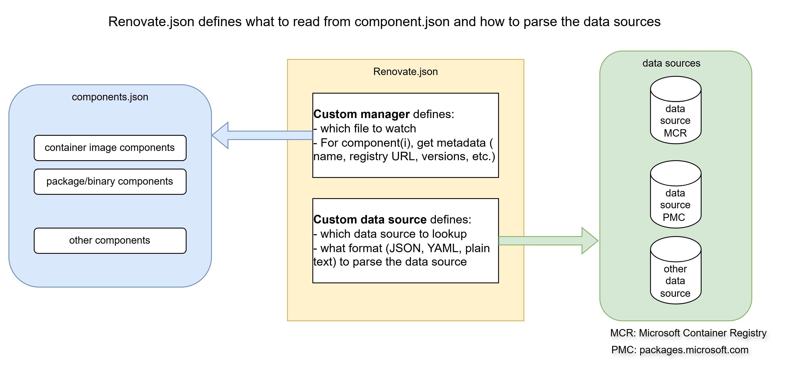
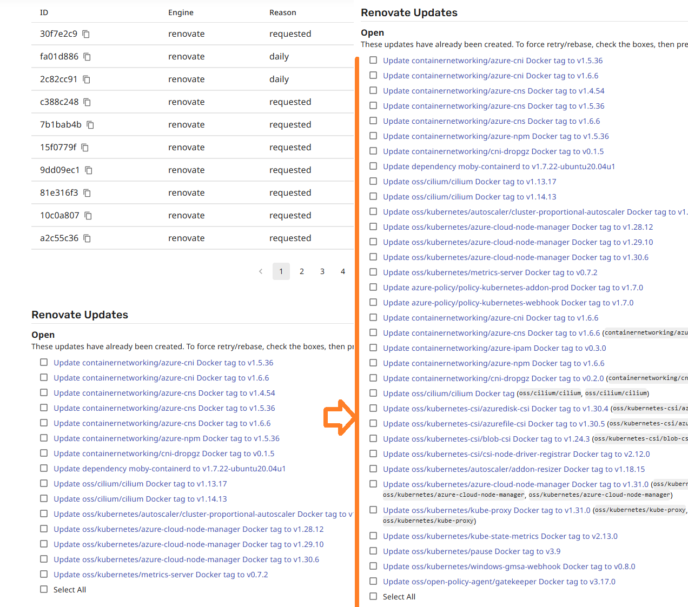
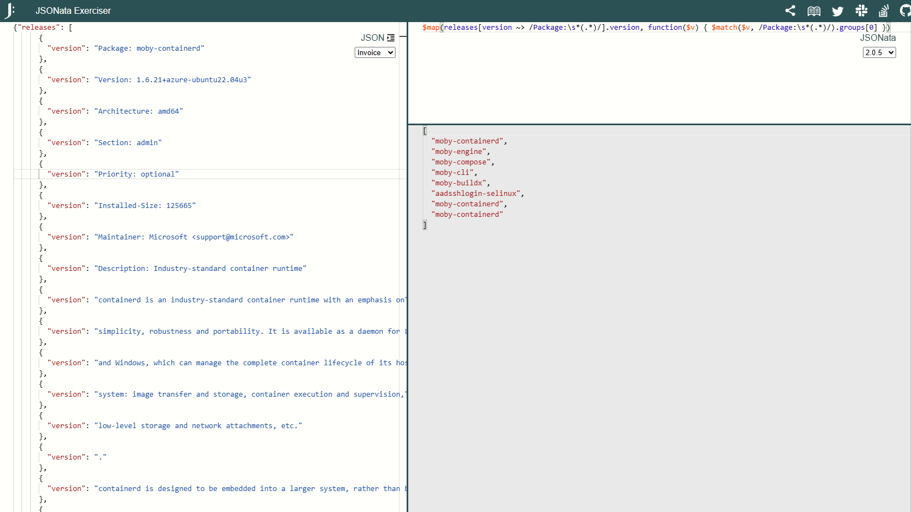

`Renovate.json` is a configuration file that defines how Renovate should interact with your custom components management file (also known as the manifest file) and how it should look up the latest versions from custom data sources.

# Table of Contents

- [Table of Contents](#table-of-contents)
- [TL;DR](#tldr)
- [Renovate configurations](#renovate-configurations)
  - [Package rules](#package-rules)
    - [Disable `minor` update](#disable-minor-update)
    - [Enable `patch`, `pin` and `digest` update](#enable-patch-pin-and-digest-update)
    - [(Optional context) To update minor or not](#optional-context-to-update-minor-or-not)
    - [Assigning specific component to specific person](#assigning-specific-component-to-specific-person)
    - [Additional string operation to specific component](#additional-string-operation-to-specific-component)
  - [Custom managers](#custom-managers)
    - [Auto update containerImages in components.json](#auto-update-containerimages-in-componentsjson)
    - [Auto update packages for OS ubuntu xx.xx in components.json](#auto-update-packages-for-os-ubuntu-xxxx-in-componentsjson)
    - [(Optional context) How to ensure a single component will not be updated by 2 multiple custom managers?](#optional-context-how-to-ensure-a-single-component-will-not-be-updated-by-2-multiple-custom-managers)
  - [Custom data sources](#custom-data-sources)
    - [(Optional context) Please read this section if you are going to config your own transformTemplates.](#optional-context-please-read-this-section-if-you-are-going-to-config-your-own-transformtemplates)
- [Hands-on guide and FAQ](#hands-on-guide-and-faq)
  - [Okay, I just have 5 minutes. Please just tell me how to onboard a new package/container now to Renovate.json for auto-update.](#okay-i-just-have-5-minutes-please-just-tell-me-how-to-onboard-a-new-packagecontainer-now-to-renovatejson-for-auto-update)
  - [What is the responsibility of a PR assignee?](#what-is-the-responsibility-of-a-pr-assignee)
  - [What components are onboarded to Renovate for auto-update and what are not yet?](#what-components-are-onboarded-to-renovate-for-auto-update-and-what-are-not-yet)
  - [Details on supporting the MAR OCI artifacts.](#details-on-supporting-the-mar-oci-artifacts)
  - [`REVISION` in Dalec built container images](#revision-in-dalec-built-container-images)
  - [How to enable auto-merge for a component's patch version update?](#how-to-enable-auto-merge-for-a-components-patch-version-update)
  - [Why are some components' `minor version update` disabled?](#why-are-some-components-minor-version-update-disabled)
  - [Debugging in local environment](#debugging-in-local-environment)
# TL;DR
This readme is mainly describing how the renovate.json is constructed and the reasoning behind. If you are adding a new component to be cached in VHD, please refer to this [Readme-components](../parts/linux/cloud-init/artifacts/README-COMPONENTS.md) for tutorial. If you are onboarding a newly added component to Renovate automatic updates, you can jump to the [Hands-on guide and FAQ](#hands-on-guide-and-faq).

# Renovate configurations
This readme file is specifically describing what the renovate.json for AgentBaker is doing and how to edit it when needed.
There are 3 major blocks in the renovate.json configurations, namely `package rules`, `custom managers` and `custom datasources`.

This diagram explains how `Renovate.json` defines the way Renovate reads the components metadata from `components.json`, and how it looks up various data sources.


## Package rules
`packageRules` in Renovate provide a powerful way to customize how dependency updates are handled for specific packages or groups of packages. By defining these rules, you can control update schedules, grouping, versioning strategies, and more, ensuring that the update process aligns with the needs of your project.

We defined some packageRule blocks in the renovate.json. Here are some examples.

### Disable `minor` update
```
    {
      "matchDatasources": ["docker", "custom.deb2004", "custom.deb2204", "custom.deb2404"],
      "matchUpdateTypes": [
        "minor"
      ],
      "automerge": false,
      "enabled": false
    },
```
- `matchDatasources`: specifies which datasources the rule should apply to. In this example, we define if a datasource is either `docker`, custom defined `custom.deb2004`, `custom.deb2204` and `custom.deb2404`, the package rule will apply. You will find the custom defined ones in the next block.
- `matchUpdateTypes`: allows you to apply specific rules to dependencies based on the type of update. In this example, if the update type is `minor`, this package rule will apply.
- `automerge`:allows you to specify whether pull requests created by Renovate should be automatically merged. `false` here mean the PR needs to be approved before it can merge.
- `enabled`: allows you to control whether a specific rule is active or not. `false` in this example means this package rule is inactive.

In summary, this package rule is saying it won't apply auto-update if the datasource is one of the values **and** it's updating minor, which means it won't update any minor.
This package rule will make more sense if you continue looking at the next package rule.

### Enable `patch`, `pin` and `digest` update

```
    {
      "matchDatasources": ["docker", "custom.deb2004", "custom.deb2204", "custom.deb2404", "custom.deb2404-test"],
      "matchUpdateTypes": [
        "patch",
        "pin",
        "digest"
      ],
      "automerge": false,
      "enabled": true
    },
```
In summary, this package rule is saying it will apply auto-update without `automerge` if the datasource is one of the values **and** it's updating either `patch`, `pin` or `digest`.

Combining these 2 package rules together is actually asking Renovate not to update `major` and `minor`, but just `patch`, `pin` and `digest`.

We configured auto-merge patch version for components `moby-runc` and `moby-containerd`. Please search `"matchPackageNames": ["moby-runc", "moby-containerd"]` in `renovate.json` for an example.

As of 01/23/2025, the PR merging policy is as follows.
| Components       | Major  | Minor  | Patch  |
| --------         | ------ | ------ | ------ |
| Runc, Containerd | Manual | Manual | Auto   |
| Others           | Manual | Manual | Manual |

The update of `Runc` and `Containerd` is owned by Node SIG and we have sufficient confidence to auto-merge it with our tests and PR gates. Thus it's set to `auto-merge`.
For other components, we are still relying on the owner teams to approve and merge. If there is a need to auto-merge a component, it's always configurable.

---

For more context to anyone who is interested, let's walk through a real example. Feel free to skip reading this if it has nothing to do with your task.

### (Optional context) To update minor or not
Using azure-cni as an example, if we enable auto updating `minor`, we will see the following PRs created by Renovate automatically at of Sep 12, 2024.
- PR1: containernetworking/azure-cni minor v1.5.32 -> v1.6.6
- PR2: containernetworking/azure-cni patch v1.6.3 -> v1.6.6
- PR3: containernetworking/azure-cni patch v1.5.32 -> v1.5.36

PR2 and PR3 are what we need because we want to auto-update the patch version.
By enabling the `minor` package rule, PR1 will also be created.
Depending on use case, for some components this could be a helpful reminder that there are updated versions but for others this could become noisy if it's intended not to update minor version but only patch version.

In components.json, it's managing 50+ components. So with `minor` package rule enabled, it will look like this screenshot.

On the left side, there is no `minor` being updated. On the right side, it added many PRs for updating the `minor` too.

We enabled auto-updating `minor` versions as default configuration for now we can revise if it ends up being too noisy. We can also turn on/off updating `minor` version for specific components.

p.s. To allow disable `minor` update but enable `patch` update, at root level `separateMinorPatch` needs to be `true`, though it's no harm to turn it on even we are also updating `minor`.

### Assigning specific component to specific person
We can use `matchPackageNames` to achieve this purpose.
For example,
```
    {
      "matchPackageNames": ["moby-runc", "moby-containerd"],
      "assignees": ["devinwong", "anujmaheshwari1", "cameronmeissner", "lilypan26", "djsly", "zachary-bailey", "ganeshkumarashok"]
      "reviewers": ["devinwong", "anujmaheshwari1", "cameronmeissner", "lilypan26", "djsly", "zachary-bailey", "ganeshkumarashok"]
    },
```
In this block, it is saying that if the package name, that a PR is updating, is one of the defined values, then assign this PR to these Github IDs. The values in `reviewers` are the same group of people to allow them to self-approve the PR. Unfortunately JSON doesn't support variable in value so we have to provide the value strings twice for both `assignees` and `reviewers`

### Additional string operation to specific component
```
    {
      "matchPackageNames": ["moby-runc", "moby-containerd"],
      "extractVersion": "^v?(?<version>.+)$"
    }
```
For some cases, the version contains a prefix `v` before the actual version (e.g., `v1.0.0`) and we only want the version without the prefix `v`. We can use this `"extractVersion": "^v?(?<version>.+)$"`. This will effectively change value of the named capture group `version` from vx.y.z to x.y.z, where `version` is a special variable that it will use during the auto-update process. Note that there is a  `matchPackageNames` condition, which means it will only apply to the components with the name defined.

## Custom managers
There are some default managers in Renovate that one can use to monitor supported components manifest files. However in AgentBaker's case, it's using a custom json file components.json so we need to use `customManagers` to watch our custom manifest. Again, let's jump into some examples for explanation.

### Auto update containerImages in components.json
```
    {
      "customType": "regex",
      "description": "auto update containerImages in components.json",
      "fileMatch": [
        "parts/common/components.json"
      ],
      "matchStringsStrategy": "any",
      "matchStrings": [
        "\"renovateTag\":\\s*\"registry=(?<registryUrl>[^,]+), name=(?<packageName>[^\"]+)\",\\s*\"latestVersion\":\\s*\"(?<currentValue>[^\"]+)\"(?:[^}]*\"previousLatestVersion\":\\s*\"(?<depType>[^\"]+)\")?"
      ],
      "datasourceTemplate": "docker",
      "autoReplaceStringTemplate": "\"renovateTag\": \"registry={{{registryUrl}}}, name={{{packageName}}}\",\n          \"latestVersion\": \"{{{newValue}}}\"{{#if depType}},\n          \"previousLatestVersion\": \"{{{currentValue}}}\"{{/if}}"
    },
```
- `customType`: `regex` here means we will use regex (regular expression) to parse our manifest file components.json.
- `description`: string description for human readability.
- `fileMatch`: the path of the manifest file(s) it needs to parse.
- `matchStringsStrategy`: controls behavior when multiple matchStrings values are provided. Three options are available: any (default), recursive, combination. `any` is used here which means each provided matchString will be matched individually to the content of the `packageFile`. Check [this link](https://docs.renovatebot.com/configuration-options/#matchstringsstrategy) to learn more about `matchStringsStrategy`.
- `matchStrings`: each entry in this array is a regex that will parse the necessary information and assign the required values to some specific named capture group. In this example, we parse the `"renovateTag": "registry=[some registry URL], name=[full path of the container image]" ...`, from components.json. And we assign 
  - the value of `registry` to a named capture group `registryUrl`, 
  - the value of `name` to a named capture group `packageName`
  - the value of `latestVersion` to a named capture group `currentValue`
  - the value of `previousLatestVersion` to a named capture group `depType`. Here we are borrowing the reserved variable name `depType` to store our `previousLatestVersion`. We do this as a hacky way because Renovate doesn't have a custom variable name for us to store this custom value for next step use.
  - Note that all the named capture group variables (`registryUrl`, etc.) listed above are reserved by Renovate, which means Renovate expects the regex should provide correct values to those variables so that Renovate can do the auto-update work as expected. Depending on user's case, the values of the variables can be defined in this block as static values, or it could extract the values from components.json so that we can keep the custom manager rule more abstractive to suit more cases. The rules are quite complicated, you will need to read the official Renovate doc to ensure everything is correct.
- `dataSourceTemplate`: allows you to define a custom template for constructing the datasource URL or other relevant information for fetching dependency updates. In this example, it's detecting ContainerImages and the `datasourceTemplate` type of it is `docker`. (I guess it's because docker is the earliest well-known implementation of container runtime)
- `autoReplaceStringTemplate`: allows you to define a custom template for automatically replacing version strings or other relevant information in your dependency files. This string template uses `Handlebars`-like syntax. Please read the official doc for more details. In this example, we use `autoReplaceStringTemplate` to replace the current version to `previousLatestVersion` and then update the latest version, which is captured from the datasource `registryURL`, to `latestVersion`. We are using this as a hacky way to keep both the latest and previous latest versions. 
  - Additional information: we borrow the reserved variable `depType` to store the current version in the `matchStrings`. And we add a `if` condition to check if we should add a `previousLatestVersion` back to the string. In short, if there are both `latestVersion` and `previousLatestVersion` in the package config in components.json, it will update both values. If there is only `latestVersion`, it will only update that version.

In 1 sentence to summarize, this custom manager monitors specific container images that match the matchStrings regex, extracts necessary metadata, directs Renovate to query a specific datasource "docker", and updates the components.json accordingly.

### Auto update packages for OS ubuntu xx.xx in components.json
Similar to containerImages described above, we have other custom manager for packages/binaries in Ubuntu. We are not updating Mariner's packages yet as we are not fully clear about the update rules.

```
    {
      "customType": "regex",
      "description": "auto update packages for OS ubuntu 22.04 in components.json",
      "fileMatch": [
        "parts/common/components.json"
      ],
      "matchStringsStrategy": "any",
      "matchStrings": [
        "\"renovateTag\":\\s*\"name=(?<packageName>[^,]+), os=ubuntu, release=22\\.04\",\\s*\"latestVersion\":\\s*\"(?<currentValue>[^\"]+)\"(?:[^}]*\"previousLatestVersion\":\\s*\"(?<depType>[^\"]+)\")?"
      ],
      "datasourceTemplate": "custom.deb2204",
      "versioningTemplate": "deb",
      "autoReplaceStringTemplate": "\"renovateTag\": \"name={{{packageName}}}, os=ubuntu, release=22.04\",\n                \"latestVersion\": \"{{{newValue}}}\"{{#if depType}},\n                \"previousLatestVersion\": \"{{{currentValue}}}\"{{/if}}"
    },
```
In 1 sentence to summarize, this custom manager monitors specific packages that match the matchStrings regex, extracts necessary metadata, directs Renovate to query a specific datasource "custom.deb2204", and updates the components.json accordingly.

### (Optional context) How to ensure a single component will not be updated by 2 multiple custom managers?
A single component should only be managed by 1 custom manager to avoid race conditions where multiple managers attempt to modify the component's configuration simultaneously. It is unclear how Renovate handles such cases. Maybe it just runs the steps sequentially with the last operation determining the final result. Anyway, we should avoid this scenario to prevent debugging difficulties.
In our Renovate.json, there are 2 types of components with different renovateTags.
- `containerImages`: `"renovateTag": "registry=, name="`
- `packages`: `"renovateTag": "name=moby-containerd, os=, release="`
We can update the format if needed.
Each custom manager will ensure it only finds one type of renovateTag.

## Custom data sources
We have some custom data sources in the renovate.json now. Let's walk through an example to explain the details.
```
    "deb2404": {
      "defaultRegistryUrlTemplate": "https://packages.microsoft.com/ubuntu/24.04/prod/dists/noble/main/binary-amd64/Packages",
      "format": "plain",
      "transformTemplates": [
        "{\"releases\": $map(($index := releases#$i[version=\"Package: {{packageName}}\"].$i; $map($index, function($i) { $substringAfter(releases[$i + 1].version, \"Version: \") })), function($v) { {\"version\": $v} })[]}"
      ]
    }
```
- The name is this custom data source is `deb2404`. We are referencing to it in the earlier section custom manager with `"datasourceTemplate": "custom.deb2404",`
  - Alongside `custom.deb2404` we provide `custom.deb2404-test`; they are identical except that `custom.deb2404-test` points to the PMC testing endpoint (https://packages.microsoft.com/ubuntu/24.04/prod/dists/testing/main/binary-amd64/Packages). We use the testing URL because the Debian package metadata for the Ubuntu 24.04 `containerdv2` package is currently published only to the testing endpoint; all other packages continue to be fetched from the production (noble) endpoint.
- `defaultRegistryUrlTemplate`: specifies the default URL template for accessing the registry of a custom datasource. In this example, it is the packages.microsoft.com/xxx URL.
- `format`: specifies the format of the data returned by the registry. In this example, it's neither json, html nor yaml but a `Debian Control File`. So we have to use `plain` and then construct the data in `transformTemplates` by ourselves.
- `transformTemplates`: allows you to define custom transformations for data fetched from a custom datasource. It uses `JSONata rules` to transform the API output in a certain format. This one is really challenging to me (Devin). Please read the official doc to try and error a correct JSONata query. At the end of the day, you will need to at least populate something like
```
{
  "releases": [
    {
      "version": "v1.1.0"
    },
    {
      "version": "v1.2.0"
    }
  ]
}
```
to `transformTemplates`.

### (Optional context) Please read this section if you are going to config your own transformTemplates.
If you are going to config your own transformTemplates JSONata query, please read the following facts carefully. I (Devin) spent plenty of time to figure this out. This will save you a lot of time.
- The inputs from your `defaultRegistryUrlTemplate` will be automatically converted to a strange json format. I didn't see this being revealed in the official doc. I could be wrong though. For example, if the raw content of my `defaultRegistryUrlTemplate` looks like this.
```
Package: moby-containerd
Version: 1.6.21+azure-ubuntu22.04u3
Architecture: amd64
...
...
Package: moby-engine
Version: 25.0.3-ubuntu22.04u1
Architecture: amd64
...
...
Package: moby-compose
Version: 2.18.0+azure-ubuntu22.04u1
Architecture: amd64
```
Renovate will actually convert this plain text file to a JSON file which looks like this.
```
{
    "releases": [
      {
        "version": "Package: moby-containerd"
      },
      {
        "version": "Version: 1.6.21+azure-ubuntu22.04u3"
      },
      {
        "version": "Architecture: amd64"
      },
      ...
      ...
      {
        "version": "Package: moby-engine"
      },
      {
        "version": "Version: 25.0.3-ubuntu22.04u1"
      },
      {
        "version": "Architecture: amd64"
      },
      ...
      ...
      {
        "version": "Package: moby-compose"
      },
      {
        "version": "Version: 2.18.0+azure-ubuntu22.04u1"
      },
      {
        "version": "Architecture: amd64"
      },
      
      ]
}
```
So the JSONata query you are working on, should take this as inputs, instead of the raw content.

How do I know that? By reading the Renovate trace carefully you will find it's actually trying to parse this JSON file.
If the raw content from your `transformTemplates` is not in plain text but other format, I would still highly recommend you enable the Renovate trace so that you can see what is happening behing the scene.

Now we figured out the inputs, we can start work on the JSONata query.

JSONata Exerciser is a good playground for us to try and error the query. This is a good example which queries the package name from the inputs. You can start playing around with this. https://try.jsonata.org/Gjq6mkXmg. Attaching a screenshot for reference in case the link is no longer available in the future.


# Hands-on guide and FAQ
> **Alert:** Before starting the hands-on guide, please take a moment to read [TL;DR](#tldr) section to ensure you are reading the correct doc.
## Okay, I just have 5 minutes. Please just tell me how to onboard a new package/container now to Renovate.json for auto-update.
**Step 1**
Depending on what kind of component you are going to onboard.
- **Container Image**:  This is the easiest one to onboard, assuming it's hosted in MCR just like other container images. Once you add it to the components.json as a new container image for VHD to cache at build time, the current custom manager in this `renovate.json` will directly monitor and update it. Specifically, it's assumed that you have already added the container Image to `components.json` in the correct format. Here is an example for a container image `addon-resizer` to `components.json`.
  ```
    {
      "downloadURL": "mcr.microsoft.com/oss/kubernetes/autoscaler/addon-resizer:*",
      "amd64OnlyVersions": [],
      "multiArchVersionsV2": [
        {
          "renovateTag": "registry=https://mcr.microsoft.com, name=oss/kubernetes/autoscaler/addon-resizer",
          "latestVersion": "1.8.22",
          "previousLatestVersion": "1.8.20"
        }
      ]
    }
  ```
  Please make sure you set the `renovateTag` correctly, where `registry` is always `https://mcr.microsoft.com` now, and the `name` doesn't have a leading slash `/`. As of Jan 2025, The container Images in `components.json` are all hosted in MCR and MCR is the only registry enabled in the current Renovate configuration file `renovate.json`. If there is demand for other container images registry, it will be necessary to double check if it will just work.

  Fore more details, you can refer to Readme-components linked at the beginning of this document.

- **Packages**: Now for datasource PMC (package.microsoft.com) we have 4 custom managers which will look up to the following 4 `defaultRegistryUrlTemplate`, based on different Ubuntu release, respectively.
  - https://packages.microsoft.com/ubuntu/18.04/prod/dists/bionic/main/binary-amd64/Packages
  - https://packages.microsoft.com/ubuntu/20.04/prod/dists/focal/main/binary-amd64/Packages
  - https://packages.microsoft.com/ubuntu/22.04/prod/dists/jammy/main/binary-amd64/Packages
  - https://packages.microsoft.com/ubuntu/24.04/prod/dists/noble/main/binary-amd64/Packages

  Note: We need to specify one and only one datasource URL for each custom manager and here we are using the `amd64` ones. It could also be `arm64`. And we are assuming if `amd64` package is updated, `arm64` package is also updated. We know the assumption is not always valid. But even only `amd64` is updated but not `arm64`, we will still be able to catch it in the VHD build tests so it should be fine.
  
  If your package is not managed by PMC, you may need to create your own custom manager and custom datasource. If this is the case, you will need to go through this doc to understand how.

**Step 2**
The next thing you will need to do is to set the assignee. This is to tell Renovate if a auto-update PR for a specific component is created, which **GitHub ID** should it assign to to get approval?
There is an example for packages `moby-runc` and `moby-containred`
```
    {
      "matchPackageNames": ["moby-runc", "moby-containerd"],
      "assignees": ["devinwong"]
      "reviewers": ["devinwong"]
    },
```
You can follow this example to create a block and fill in the matchPackageNames with your **GitHub ID** to assign and set reviewer to yourself, assuming you are the owner. Note that the packageName here must be the exact name that you can find in your datasource. For example, in the datasource PMC which hosts `moby-runc` and `moby-containerd`, we are running `apt-get install moby-runc moby-containerd`. So this is the correct package name.

Another example is for a container image `mcr.microsoft.com/oss/kubernetes/kube-proxy`. In this case you should fill in the matchPackageNames with packageName `oss/kubernetes/kube-proxy`. Note there is no leading slash `/`.

**Step 3**
To test if you have completed the steps above correctly, you can set your `latestVersion` in components.json to a previous version and see if Renovate will automatically create a PR to update to the latest one.
Screenshot and detailed steps will be provided later once my (Devin's) renovate-onboard PR is merged to Agent Baker master branch.

## What is the responsibility of a PR assignee?
If your GitHub ID is placed in the `assignees` array, you are responsible for those components. When Renovate creates a PR to update a component to the latest version, you must decide whether to approve, modify or cancel the PR. You can have a list of assignees.
- Approve: If the updated version looks good to you, you can approve it. If you need additional reviews from Node SIG, proceed as usual.
- Modify: In some cases, you may want to modify the code or the components.json to update to a different version. you can take the branch that Renovate created and change the code and components.json as desired.
- Cancel: If you don't need the PR that Renovated created (e.g., the specific version is not desired), you can cancel the PR.

## What components are onboarded to Renovate for auto-update and what are not yet?
In general, if a component has the `"renovateTag": "<DO_NOT_UPDATE>"`, it means it's not monitored by Renovate and won't be updated automatically.

As of 01/23/2025,
- All the container images are onboarded to Renovate for auto-update.
- PMC hosted packages, namely `runc` and `containerd`, are configured as auto-merge patch version.
- OCI artifacts hosted on MAR(aka MCR) such as `kubernetes-binaries` and `azure-acr-credential-provider` are onboarded for auto-update.
- For Linux, the cni-plugins, azure-cni, cri-tools binaries are hosted at packages.aks.azure.com and are not onboarded for auto-update yet. The team has been working on this. cri-tools package will soon be available, then cni-plugins and azure-cni.

For the most up-to-date information, please refer to the actual configuration file `components.json`.

## Details on supporting the MAR OCI artifacts.
MAR OCI artifact is a bit special. The artifact is hosted/stored in a container registry (e.g. MCR, now rebranded to MAR), while it's not necessarily a container image. Instead it could be any format such as Helm charts, Software Bill of Materials (SBOM), a package or a tar/tgz file.
The `renovate.json` file is configured to support OCI artifact now. There is a packageRule like below to support auto updating OCI artifact, which is,
```
    {
      "matchDatasources": ["docker"],
      "matchPackageNames": ["oss/binaries/kubernetes/kubernetes-node", "oss/binaries/kubernetes/azure-acr-credential-provider"],
      "extractVersion": "^(?P<version>.*?)-[^-]*-[^-]*$"
    },
```
Explanations as below.
1. The `datasource` should be `docker`.
2. The `packageName` should be one of those in the list.
3. In `extractVersion`, we use a regex to extract only part of the tag as the version to be stored in `latestVersion` in `components.json`.

Take `kubernetes-binaries` as an example. If you view all the tags from this list https://mcr.microsoft.com/v2/oss/binaries/kubernetes/kubernetes-node/tags/list?n=10000, you will notice that the format of the tags is quite varied, like, `v1.27.100-akslts-linux-amd64` , `v1.30.0-linux-amd64`, `v1.31.1-linux-arm64`. This regex is to capture only the values before the second-to-last dash (-). For example, if the tag is `v1.27.100-akslts-linux-amd64`, we capture `v1.27.100-akslts` as the version to be stored in `latestVersion` in `components.json`. If the tag is `v1.30.0-linux-amd64`, we capture `v1.30.0`. We do not capture the CPU architecture (amd64|arm64) to keep it generic, avoiding the need to define the same thing for both `amd64` and `arm64`. 

Packages in `components.json` are onboarded now: `oss/binaries/kubernetes/kubernetes-node`, `oss/binaries/kubernetes/azure-acr-credential-provider`, etc. You will see a new tag `OCI_registry` in `renovateTag`. 

Continue using `kubernetes-binaries` as an example. Here is a block of version information defined as follows.
```
{
  "k8sVersion": "1.31",
  "renovateTag": "OCI_registry=https://mcr.microsoft.com, name=oss/binaries/kubernetes/kubernetes-node",
  "latestVersion": "v1.31.2",
  "previousLatestVersion": "v1.31.1"
}
```
where
1. `k8sVersion` is optional and specifies that it is tied to Kubernetes  v1.31.
2. `renovateTag` defines the OCI registry and artifact name that Renovate should look up from its datasource.
3. `latestVersion` and `previousLatestVersion` define the versions to be cached as usual.

And next you will see
```
"downloadURL": "mcr.microsoft.com/oss/binaries/kubernetes/kubernetes-node:${version}-linux-${CPU_ARCH}"
```
where 
- `${version}` will be resolved at runtime with the `latestVersion` and `previousLatestVersion` defined above.
- `${CPU_ARCH}` will be resolved at runtime depending on the CPU architecture of the Node (VM) under provisioning.

## `REVISION` in Dalec built container images
Dalec-built container images use static tags in the form `vMAJOR.MINOR.PATCH-REVISION` (see the Dalec FAQ https://github.com/Azure/dalec-build-defs/blob/main/faq.md#how-do-floating-vs-static-tags-work for details). For clarity and deterministic caching we represent these container images in Agent Baker's `components.json` using the exact static tag `vMAJOR.MINOR.PATCH-REVISION`.

The upstream Azure Cloud Native team has confirmed these container images will be published under names that start with `oss/v2`. To ensure Renovate parses and compares these tags correctly, we have a dedicated package-rule in renovate.json for `oss/v2` container images that uses this versioning regex:

`"versioning": "regex:^v(?<major>\d+)\.(?<minor>\d+)\.(?<patch>\d+)-(?<prerelease>\d+)$"`

Notes:

- This regex expects an optional leading v, three numeric version components, and a numeric revision (the prerelease) separated by a final hyphen. 
  Example valid tags: `v0.1.15-4`, `v1.2.3-12345678`.
- When you add a new Dalec-built container image, you don't need to add its package name to `oss/v2/**` package rule because the `oss/v2/**` wildcard already covers all Dalec images.

## How to enable auto-merge for a component's patch version update?
This is a common scenario where we want the PR to be merged automatically when a PR is created for a patch version update. You can refer to `moby-runc` and `moby-containerd` in `AgentBaker/.github/renovate.json` as an example. 

```
   {
      "matchPackageNames": ["moby-runc", "moby-containerd"],
      "matchUpdateTypes": [
        "patch"
      ],
      "automerge": true,
      "enabled": true,
      "assignees": ["devinwong", "anujmaheshwari1", "cameronmeissner", "lilypan26", "djsly", "zachary-bailey", "ganeshkumarashok"],
      "reviewers": ["devinwong", "anujmaheshwari1", "cameronmeissner", "lilypan26", "djsly", "zachary-bailey", "ganeshkumarashok"]
    },
```
The config includes:
- `matchPackageNames`: The name of the component's renovateTag in `AgentBaker/parts/common/components.json`. For example `moby-containerd`, `oss/kubernetes/kube-proxy`, `oss/binaries/kubernetes/kubernetes-node`. Wildcard character (*) is supported too. For example, `"matchPackageNames": ["oss/kubernetes-csi/*"],`
- `matchUpdateTypes`: The type of version updates (`patch`) to which this rule applies.
- `automerge`: Set to `true` to automatically merge PRs created by this rule. Default is `false`.
- `enabled`: Set to `true` to enable this rule.
- `assignees` and `reviewers`: The same group of GitHub IDs who will be assigned to and can review and approve the automatically created PRs.

## Why are some components' `minor version update` disabled?
For many components which have defined multiple versions cached in the components.json, we have disabled the `minor version update`. The reason is that Renovate would create many unncessary PRs. For example if a component has cached `v0.1.1` and `v0.2.1`, and `minor version update` is enabled, when a new minor version `v0.3.1` is released, Renovate will create 2 PRs, namely `v0.1.1 update to v0.3.1` and `v0.2.1 update to v0.3.1`. Both PRs will try to update to the same version `v0.3.1`. This is usually not intended because the onwers would like to cache multiple versions. Therefore, by default, we have disabled `minor version update` for such components.

## Debugging in local environment
To debug with verbose traces, it's recommended to set up a local environment for testing.
Below are the steps to achieve this, using Windows PowerShell as an example. Other options, such as using a docker image, are also available, but you will need to figure out how to use them.
1. Open a PowerShell terminal and navigate to the root directory of your source code.
2. Set the LOG_LEVEL environment variable to the desired level. For example:
   - `$Env:LOG_LEVEL = "debug"` for debug logs.
   - `$Env:LOG_LEVEL = "trace"` for the most verbose logs. Refer to the official documentation for other options.
3. Assuming you have `npm` installed, run this command 
   ```
   npx renovate --platform=local --dry-run=true`
   ```
   - where `dry-run=true` means that it will perform the data source lookup but not really creating a branch and PR.
   - Renovate will automatically locate the required Renovate config file, which is `.github/renovate.json` in this case.

**Example 1: Get log level `info` from a local environment.**
```
PS C:\Users\devinwon\git\AgentBaker> npx renovate --platform=local --dry-run=true
 WARN: cli config dryRun property has been changed to full
 INFO: Repository started (repository=local)
       "renovateVersion": "39.250.3"
 INFO: Dependency extraction complete (repository=local)
       "stats": {
         "managers": {"regex": {"fileCount": 6, "depCount": 119}},
         "total": {"fileCount": 6, "depCount": 119}
       }
 WARN: Package lookup failures (repository=local)
       "warnings": [
         "Failed to look up custom.deb2004 package kubernetes-cri-tools",
         "Failed to look up custom.deb2404 package kubernetes-cri-tools"
       ],
       "files": ["parts/common/components.json"]
 INFO: DRY-RUN: Would ensure Dependency Dashboard (repository=local)
       "title": "Dependency Dashboard"
 INFO: DRY-RUN: Would save repository cache. (repository=local)
 INFO: Repository finished (repository=local)
       "cloned": undefined,
       "durationMs": 54184
 INFO: Renovate was run at log level "info". Set LOG_LEVEL=debug in environment variables to see extended debug logs.
```
This example reproduces what was observed on the Mend.io Renovate App. Then I change the LOG_LEVEL to `trace` for more detailed logs.

**Example 2: Get log level `trace` from a local environment.**

If the outputs are very large, you can pipe them to a file for better readability:
```
PS C:\Users\devinwon\git\AgentBaker> npx renovate --platform=local --dry-run=true >> output.txt
```
You won't see any progress in the terminal because all the outputs are piped to the file. Just wait until the process completes.
In the `output.txt` of my case, I found this,
```
       "after": {"releases": {"version": "1.32.0-ubuntu18.04u3"}}
DEBUG: Response has failed validation (repository=local)
       "err": {
         "message": "Schema error",
         "stack": "ZodError: Schema error\n    at Object.get error [as error] 
...
...
TRACE: Dependency lookup success (repository=local)
       "dep": {
         "versioning": "deb",
         "updates": [],
         "warnings": [
           {
             "topic": "kubernetes-cri-tools",
             "message": "Failed to look up custom.deb2004 package kubernetes-cri-tools"
           }
         ]
       }
```
where `{"releases": {"version": "1.32.0-ubuntu18.04u3"}}` is not the format I want. The correct format should be 
```
{"releases": [{"version": "1.32.0-ubuntu18.04u3"}]}
```
This demonstrates how to identify and debug issues in Renovate configurations.