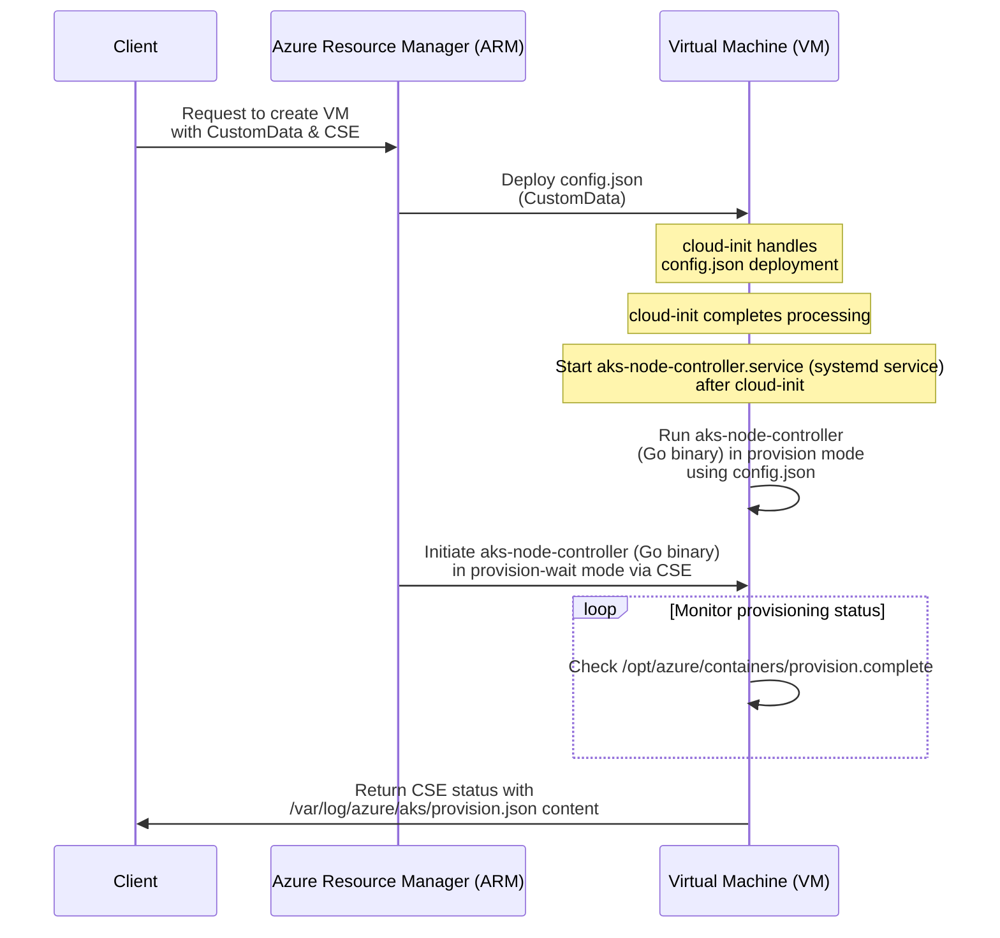

# AKS Node Controller

## Overview

AKS Node Controller is a go binary that is responsible for bootstrapping AKS nodes. The controller expects a predefined contract from the client of type [`aksnodeconfigv1.Configuration`](pkg/gen/aksnodeconfig/v1).

AKS Node Controller relies on two Azure mechanisms for injecting the necessary bootstrap data during provisioning: [`Custom Script Extension (CSE)`](https://learn.microsoft.com/en-us/azure/virtual-machines/extensions/custom-script-linux) and [`Custom Data`](https://learn.microsoft.com/en-us/azure/virtual-machines/custom-data}). The bootstrapper should use `GetNodeBootstrapping` which returns the corresponding `CustomData` and `CSE` based on the given `AKSNodeConfig`. For guidance on populating the config, please refer to this [doc](https://github.com/Azure/AgentBaker/tree/dev/pkg/proto/aksnodeconfig/v1).

## Usage

Here is an example of how to retrieve node bootstrapping parameters and use the returned `CSE` and `CustomData` for creating a Virtual Machine Scale Set (VMSS) instance via the CRP API.

```go
config := &aksnodeconfigv1.Configuration{
    Version: "v0",
    // fill in the rest of the fields
}
customData, err := nodeconfigutils.CustomData(config)
if err != nil {
    return err
}

cse := nodeconfigutils.CSE

model := armcompute.VirtualMachineScaleSet{
    Properties: &armcompute.VirtualMachineScaleSetProperties{
        VirtualMachineProfile: &armcompute.VirtualMachineScaleSetVMProfile{
            OSProfile: &armcompute.VirtualMachineScaleSetOSProfile{
                CustomData: &customData,
            },
            ExtensionProfile: &armcompute.VirtualMachineScaleSetExtensionProfile{
                Extensions: []*armcompute.VirtualMachineScaleSetExtension{
                    {
                        Name: to.Ptr("vmssCSE"),
                        Properties: &armcompute.VirtualMachineScaleSetExtensionProperties{
                            Publisher:               to.Ptr("Microsoft.Azure.Extensions"),
                            Type:                    to.Ptr("CustomScript"),
                            TypeHandlerVersion:      to.Ptr("2.0"),
                            AutoUpgradeMinorVersion: to.Ptr(true),
                            Settings:                map[string]interface{}{},
                            ProtectedSettings: map[string]interface{}{
                                "commandToExecute": cse,
                            },
                        },
                    },
                },
            },
        },
    },
}
```

### Extracting Provision Status

The provision status can be extracted from the CSE response. CSE takes the stdout from the bootstrap scripts which contains information in the form [`datamodel.CSEStatus`](https://github.com/Azure/AgentBaker/blob/dev/pkg/agent/datamodel/types.go#L2189).

Here is an example response return by CSE:
```
[stdout]
{
    "ExitCode": "0",
    "Output": "+ [[ ubuntu != \\a\\z\\u\\r\\e\\l\\i\\n\\u\\x ]]\n++ date\n+ echo 'Recreating man-db auto-update flag file and kicking off man-db update process at Tue Nov 12 17:24:23 UTC 2024....endcustomscript\n+ exit 0",
    "Error": "",
    "ExecDuration": "18",
    "KernelStartTime": "Tue 2024-11-12 17:23:33 UTC",
    "CloudInitLocalStartTime": "Tue 2024-11-12 17:23:35 UTC",
    "CloudInitStartTime": "Tue 2024-11-12 17:23:39 UTC",
    "CloudFinalStartTime": "Tue 2024-11-12 17:24:05 UTC",
    "NetworkdStartTime": "Tue 2024-11-12 17:23:37 UTC",
    "CSEStartTime": "Tue Nov 12 17:24:06 UTC 2024",
    "GuestAgentStartTime": "Tue 2024-11-12 17:23:53 UTC",
    "SystemdSummary": "",
    "BootDatapoints": {
        "KernelStartTime": "Tue 2024-11-12 17:23:33 UTC",
        "CSEStartTime": "Tue Nov 12 17:24:06 UTC 2024",
        "GuestAgentStartTime": "Tue 2024-11-12 17:23:53 UTC",
        "KubeletStartTime": "Tue 2024-11-12 17:24:20 UTC"
    }
}
[stderr]
```

### Provisioning Flow

Here is an indepth explanation of the provisioning flow. Upon first startup, CustomData is made available to the VM, after which cloud-init is able to process the content, in this case, writing the bootstrap config to disk. The binary is triggered by a systemd unit, [`aks-node-controller.service`](https://github.com/Azure/AgentBaker/blob/dev/parts/linux/cloud-init/artifacts/aks-node-controller.service) which is automatically run once cloud-init is complete. In this way, we are ensuring the bootstrapping config is present on the node and can proceeed to run the go binary to start the bootstrapping process.

Clients need to provide CSE and Custom Data. [nodeconfigutils](pkg/nodeconfigutils) module contains helpers for generating these values.

1. Custom Data: Contains base64 encoded bootstrap configuration of type [aksnodeconfigv1.Configuration](pkg/gen/aksnodeconfig/v1) in json format which is placed on the node through cloud-init write directive.

Format:
```yaml
#cloud-config
write_files:
- path: /opt/azure/containers/aks-node-controller-config.json
  permissions: "0755"
  owner: root
  content: !!binary |
   {{ encodedAKSNodeConfig }}`
```

2. CSE: Script used to poll bootstrap status and return exit status once complete.

CSE script: `/opt/azure/containers/aks-node-controller provision-wait`


#### Provisioning flow diagram:



Key components:

1. `aks-node-controller.service`: systemd unit that is triggered once cloud-init is complete (guaranteeing that config is present on disk) and then kickstarts bootstrapping.
2. `aks-node-controller` go binary with two modes:

- **provision**: parses the node config and triggers bootstrap process
- **provision-wait**: waits for `provision.complete` to be present and reads `provision.json` which contains the provision output of type `CSEStatus` and is returned by CSE through capturing stdout
