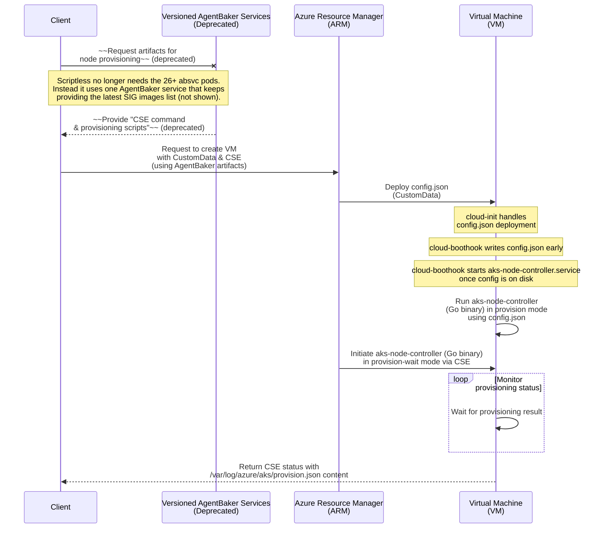

# AKS Node Controller

## Overview

AKS Node Controller is a go binary that is responsible for bootstrapping AKS nodes. The controller expects a predefined contract from the client of type [`aksnodeconfigv1.Configuration`](pkg/gen/aksnodeconfig/v1).

AKS Node Controller relies on two Azure mechanisms for injecting the necessary bootstrap data during provisioning: [`Custom Script Extension (CSE)`](https://learn.microsoft.com/en-us/azure/virtual-machines/extensions/custom-script-linux) and [`Custom Data`](https://learn.microsoft.com/en-us/azure/virtual-machines/custom-data}). The bootstrapper should use `GetNodeBootstrapping` which returns the corresponding `CustomData` and `CSE` based on the given `AKSNodeConfig`. For guidance on populating the config, please refer to this [doc](https://github.com/Azure/AgentBaker/tree/master/aks-node-controller/proto).

## Usage

Here is an example of how to retrieve node bootstrapping parameters and use the returned `CSE` and `CustomData` for creating a Virtual Machine Scale Set (VMSS) instance via the CRP API.

```go
config := &aksnodeconfigv1.Configuration{
    Version: "v1",
    // fill in the rest of the fields
}
customData, err := nodeconfigutils.CustomData(config)
if err != nil {
    return err
}

cse := nodeconfigutils.CSE

model := armcompute.VirtualMachineScaleSet{
    Properties: &armcompute.VirtualMachineScaleSetProperties{
        VirtualMachineProfile: &armcompute.VirtualMachineScaleSetVMProfile{
            OSProfile: &armcompute.VirtualMachineScaleSetOSProfile{
                CustomData: &customData,
            },
            ExtensionProfile: &armcompute.VirtualMachineScaleSetExtensionProfile{
                Extensions: []*armcompute.VirtualMachineScaleSetExtension{
                    {
                        Name: to.Ptr("vmssCSE"),
                        Properties: &armcompute.VirtualMachineScaleSetExtensionProperties{
                            Publisher:               to.Ptr("Microsoft.Azure.Extensions"),
                            Type:                    to.Ptr("CustomScript"),
                            TypeHandlerVersion:      to.Ptr("2.0"),
                            AutoUpgradeMinorVersion: to.Ptr(true),
                            Settings:                map[string]interface{}{},
                            ProtectedSettings: map[string]interface{}{
                                "commandToExecute": cse,
                            },
                        },
                    },
                },
            },
        },
    },
}
```

### Extracting Provision Status

The provision status can be extracted from the CSE response. CSE takes the stdout from the bootstrap scripts which contains information in the form [`datamodel.CSEStatus`](https://github.com/Azure/AgentBaker/blob/dev/pkg/agent/datamodel/types.go#L2189).

Here is an example response return by CSE:
```
[stdout]
{
    "ExitCode": "0",
    "Output": "+ [[ ubuntu != \\a\\z\\u\\r\\e\\l\\i\\n\\u\\x ]]\n++ date\n+ echo 'Recreating man-db auto-update flag file and kicking off man-db update process at Tue Nov 12 17:24:23 UTC 2024....endcustomscript\n+ exit 0",
    "Error": "",
    "ExecDuration": "18",
    "KernelStartTime": "Tue 2024-11-12 17:23:33 UTC",
    "CloudInitLocalStartTime": "Tue 2024-11-12 17:23:35 UTC",
    "CloudInitStartTime": "Tue 2024-11-12 17:23:39 UTC",
    "CloudFinalStartTime": "Tue 2024-11-12 17:24:05 UTC",
    "NetworkdStartTime": "Tue 2024-11-12 17:23:37 UTC",
    "CSEStartTime": "Tue Nov 12 17:24:06 UTC 2024",
    "GuestAgentStartTime": "Tue 2024-11-12 17:23:53 UTC",
    "SystemdSummary": "",
    "BootDatapoints": {
        "KernelStartTime": "Tue 2024-11-12 17:23:33 UTC",
        "CSEStartTime": "Tue Nov 12 17:24:06 UTC 2024",
        "GuestAgentStartTime": "Tue 2024-11-12 17:23:53 UTC",
        "KubeletStartTime": "Tue 2024-11-12 17:24:20 UTC"
    }
}
[stderr]
```

### Provisioning Flow

On first startup, cloud-init processes CustomData and writes the bootstrap configuration to disk. The cloud boothook starts [`aks-node-controller.service`](../parts/linux/cloud-init/artifacts/aks-node-controller.service) after the configuration is available, and the controller starts the bootstrap process.

Clients need to provide CSE and Custom Data. [nodeconfigutils](pkg/nodeconfigutils) module contains helpers for generating these values.

1. Custom Data: Contains base64 encoded bootstrap configuration of type [aksnodeconfigv1.Configuration](pkg/gen/aksnodeconfig/v1) in json format which is placed on the node through cloud-init write directive.

    Format:
    ```yaml
    #cloud-config
    write_files:
    - path: /opt/azure/containers/aks-node-controller-config.json
    permissions: "0755"
    owner: root
    content: !!binary |
    {{ encodedAKSNodeConfig }}`
    ```

2. CSE: Script used to poll bootstrap status and return exit status once complete.

   CSE script: `/opt/azure/containers/aks-node-controller provision-wait`


#### Provisioning flow diagram:


```mermaid
sequenceDiagram
    participant Client as Client
    participant AgentBaker as Versioned AgentBaker Services<br/>(Deprecated)
    participant ARM as Azure Resource Manager<br/>(ARM)
    participant VM as Virtual Machine<br/>(VM)

    Client -x AgentBaker: ~~Request artifacts for<br/> node provisioning~~ (deprecated)
    note over Client, AgentBaker: Scriptless no longer needs the 26+ absvc pods.<br/> Instead it uses one AgentBaker service that keeps<br/> providing the latest SIG images list (not shown).

    AgentBaker-->>Client: ~~Provide "CSE command<br/> & provisioning scripts"~~ (deprecated)

    Client->>ARM: Request to create VM<br/>with CustomData & CSE<br/>(using AgentBaker artifacts)
    ARM->>VM: Deploy config.json<br/>(CustomData)
    note over VM: cloud-init handles<br/>config.json deployment

    note over VM: cloud-boothook writes config.json early
    note over VM: cloud-boothook starts aks-node-controller.service<br/>once config is on disk
    VM->>VM: Run aks-node-controller<br/>(Go binary) in provision mode<br/>using config.json

    ARM->>VM: Initiate aks-node-controller (Go binary)<br/>in provision-wait mode via CSE

    loop Monitor provisioning status
        VM->>VM: Wait for provisioning result
    end

    VM-->>Client: Return CSE status with<br/>/var/log/azure/aks/provision.json content
```

#### Provision result

`/var/log/azure/aks/provision.json` contains the CSE exit code, output, error, and boot timing data. Writers stage the result in the same directory, set mode `0644`, and atomically rename it to `provision.json`, so readers never observe partial JSON. The payload is also emitted to stdout.

`cse_start.sh` writes the detailed result after bootstrap. If bootstrap cannot start, `aks-node-controller` writes a fallback result. An existing shell result is preserved because it contains richer diagnostics.

PIS generalization must remove `provision.json` before image capture.

Key components:

1. `aks-node-controller.service`: systemd unit that can be started directly by cloud-boothook as soon as the config file is written, while remaining enabled on the VHD as a fallback boot hook.
2. `aks-node-controller` go binary with two modes:

- **provision**: Parses the node configuration and starts the bootstrap sequence.
    - The controller performs a tolerant (forward‑compatible) parse of `aksnodeconfigv1.Configuration`: unknown fields, additional enum values, or future‑version knobs are ignored (and may be logged) so that a newer control‑plane can talk to an older VHD image.
    - If the config cannot be safely interpreted and no result exists, the controller atomically writes a fallback failure to `provision.json`.
    - Once the bootstrap scripts have written their detailed `provision.json`, the controller preserves that result instead of replacing it with the less specific process error.
- **provision-wait**: Waits for provisioning, then reads and evaluates `provision.json`. A non-zero serialized exit code makes the command fail while the full JSON remains available on stdout.
