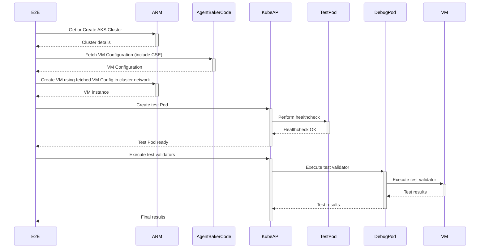

# AgentBaker E2E Testing

This directory contains files related to the AgentBaker E2E testing framework.

## Overview

AgentBaker E2E tests verify that node bootstrapping artifacts generated by the AgentBaker API are correct and capable of integrating Azure VMs into Azure Kubernetes Service (AKS) clusters. 

The E2E scenario template is defined in [RunScenario](https://github.com/Azure/AgentBaker/blob/1b473cfedd7f9836a1d52ed7fff4c74c6b8a4442/e2e/scenario_helpers_test.go#L83).
On a high level, for each scenari:

1. a new VMSS containing a single VM will be created.
2. CSE and custom data are generated, which will then be applied to the new VM so it can bootstrap and register with the AKS cluster apiserver.
3. Liveness and health checks and then run to make sure the new VM's kubelet is posting NodeReady, and that workload pods can successfully be scheduled and run on the new node.



To write an E2E scenario,

- choose a testing cluster. There are a few defined in [cluster.go](https://github.com/Azure/AgentBaker/blob/dev/e2e/cluster.go), e.g,
  - ClusterKubenetAirgap
  - ClusterAzureNetwork
  - ClusterKubenet
- use `NodeBootstrappingConfiugration` (`nbc`) to setup your scenario. it is used to invoke the primary node-bootstrapping API [GetLatestNodeBootstrapping](https://github.com/Azure/AgentBaker/blob/2e730b5a498c5be9b082d912fd08ac9346582db9/pkg/agent/bakerapi.go#L14).
- to modify agentpool properties, usually you need to set both `nbc.containerService.properties.AgentPoolProfiles[0].xxx` as well as `nbc.agentPoolProfile`. It is because when RP invokes AgentBaker, it will set the properties in this way and in e2e we follow the pattern.
- use `VMConfigMutator` to set VMSS properties such as SKU when needed.  Check [vmss](https://github.com/Azure/AgentBaker/blob/dev/e2e/vmss.go) for other configs.
it is necessary to set `nbc.agentPoolProfile.VMSize` to match the VMSS SKU if you choose to change.
- use `Validator` to include your own verification of the VM's live state, such as file existsnce, sysctl settings, etc.

### TL;DR

E2E scenarios can be configured with VMSS configuration mutators that change/set properties on the VMSS model used to deploy the new VM to be bootstrapped. This is primarily useful when testing out different VM SKUs, especially for GPU-enabled scenarios which affect which code paths AgentBaker will use to generate CSE and custom data

Further, in order to support E2E scenarios which test different underlying AKS cluster configurations, such as the cluster's network plugin, each E2E scenario uses one of the predefined clusters. Same cluster can be reused in different test runs. If cluster doesn't exist a new one will be created automatically.

Lastly, E2E scenarios also consist of a list of live VM validators. Each live VM validator consists of a description, a bash command which will actually be run on the newly bootstrapped VM, and an "asserter" function that will perform assertions on the contents of both the stdout and stderr streams that result from the execution of the command. The validators can be used to assert on numerous types of properties of the live VM, such as the live file system and kernel state.

## Running Locally

To run the E2E test suite locally, use `e2e-local.sh`.

Check [config.go](config/config.go) for the default configuration parameters. You can override these parameters by setting ENV variables. You can either:

- create a `.env` file in the `e2e` directory to set environment variables and avoid manual setup each time you run tests. Refer to `.env.sample` for an example.
- pass in the config on the command line, as following

### Common Tasks

- to run scenarios by tag: Use `TAGS_TO_RUN=` to specify scenarios based on tags. By default, all scenarios run. Multiple tags should be comma-separated and are case-insensitive. Check logs for test tags.
- to exclude scenarios, use `TAGS_TO_SKIP=`. Scenarios with any specified tags will be skipped (this logic is different to TAGS_TO_RUN).
- by run scenario by name: `TAGS_TO_RUN="name=`
- to run against VHD built from a branch other than master, `BUILD_ID=`
- to run against VHD in a different gallery, `GALLERY_SUBSCRIPTION_ID=` and `GALLERY_RESOURCE_GROUP=`
- to keep the vmss for debugging `KEEP_VMSS=true`. remember to delete the node afterwards manually `k delete node`.

for example:

```bash
TAGS_TO_RUN="os=ubuntu,arch=amd64,wasm=false,gpu=false,imagename=1804gen2containerd" ./e2e-local.sh
TAGS_TO_RUN="name=Test_azurelinuxv2" ./e2e-local.sh 
GALLERY_SUBSCRIPTION_ID="a15c116e-99e3-4c59-aebc-8f864929b4a0" GALLERY_RESOURCE_GROUP="akswinvhdbuilderrg" BUILD_ID="" TAGS_TO_RUN="name=" ./e2e-local.sh
```

When adding tests for a **new** VHD image, ensure to add a delete-lock to prevent the garbage collector from deleting the image version.

### GO Test

`e2e-local.sh` simply wraps `go test` and you can use `go test` to replace all cases above. You can use all `go test` flags, e.g.,

- `-v`: Verbose output
- `-parallel 100`: Run 100 tests in parallel, default is limited to the number of cores
- `-timeout 90m`: Set timeout, default is 10 minutes which is often exceeded
- `-count 1`: Disable test caching

```bash
go test -parallel 100 -timeout 90m -v -count 1

go test -run Test_azurelinuxv2 
```

### Debugging

Start with `KEEP_VMSS=true` to retain the node.

Each E2E scenario will generate its own logs after execution. Currently, these logs consist of:

- `cluster-provision.log` - CSE execution log, retrieved from `/var/log/azure/aks/cluster-provision.log` (collected in
  success and CSE failure cases)
- `kubelet.log` - the kubelet systemd unit's logs retrived by running `journalctl -u kubelet` on the VM after
  bootstrapping has finished (collected in success and CSE failure cases)
- `vmssId.txt` - a single line text file containing the unique resource ID of the VMSS created by the respective
  scenario, mainly collected for the purposes of posthoc resource deletion (collected in all cases where the VMSS is
  able to be created)
- (when `VMSS=true`) the VM's private SSH key.

These logs will be uploaded in a bundle of the format:

```bash
└── scenario-logs
    └── <scenario>
        ├── cluster-provision.log
        ├── kubelet.log
        ├── vmssId.txt
```

### Cleanup

Azure resources are deleted periodically by an external garbage collector. Locally stopped tests attempt a graceful shutdown to clean up resources. Old VMs are deleted on startup unless created with `KEEP_VMSS=true`.

## Coverage report

After a PR is created in AgentBaker's repo on GitHub, a pipeline calculating code coverage changes will automatically run.

We are utilizing [coveralls](https://coveralls.io/) to display the coverage report. The coverage report will be available in the PR's description.
You can also view previous runs for the AgentBaker repo [here](https://coveralls.io/github/Azure/AgentBaker). We calculate code coverage for both unit tests and E2E tests.

### E2E coverage report

To generate E2E coverage reports, we use code [coverage changes](https://go.dev/blog/integration-test-coverage) introduced in Go 1.20. See the docs [here](https://go.dev/testing/coverage/#panicprof). The following packages are used during calculation of coverage for E2E tests:

```sh
- github.com/Azure/agentbaker/apiserver
- github.com/Azure/agentbaker/cmd
- github.com/Azure/agentbaker/cmd/starter
- github.com/Azure/agentbaker/pkg/agent
- github.com/Azure/agentbaker/pkg/agent/datamodel
- github.com/Azure/agentbaker/pkg/templates
```

Coverage report is generated by running AgentBaker's API server locally as a binary created with the `-cover` flag. E2E tests are then ran against that binary.

```bash
  # start server
  GOCOVERDIR=covdatafiles ./baker start &  
  cd cmd
  #Create directory for coverage report files
  mkdir -p covdatafiles
  go build -cover -o baker -covermode count

  /bin/bash e2e/e2e-local.sh
  # When finished, stop server with exit code 0 to generate the report.
  kill $(pgrep baker)

  # display coverage report
 go tool covdata percent -i=./cmd/somedata

```
