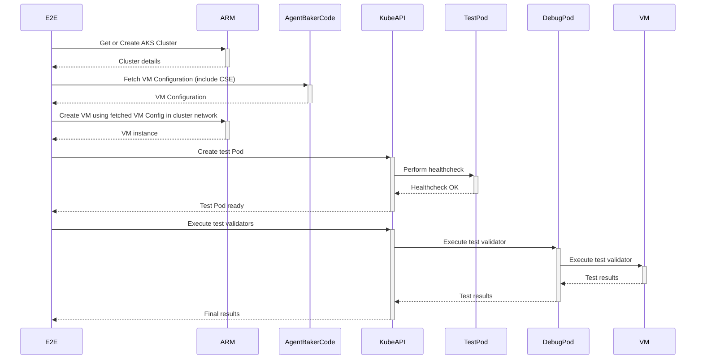

# AgentBaker E2E Testing

This directory contains files related to the AgentBaker E2E testing framework.

## Overview

AgentBaker E2E tests verify that node bootstrapping artifacts generated by the AgentBaker API are correct and capable of integrating Azure VMs into Azure Kubernetes Service (AKS) clusters.

From a high-level, each E2E scenario makes a call out to the primary node-bootstrapping
API [GetLatestNodeBootstrapping](https://github.com/Azure/AgentBaker/blob/2e730b5a498c5be9b082d912fd08ac9346582db9/pkg/agent/bakerapi.go#L14)
with a set of parameters (represented by a NodeBootstrappingConfiugration) which define the given scenario to generate
CSE and custom data. A new VMSS containing a single VM will then be created and associated with an AKS cluster that is
already running in Azure. The CSE and custom data generated by AgentBaker will then be applied to the new VM so it can
bootstrap and register itself with the apiserver of the running cluster. Liveness and health checks and then run to make
sure the new VM's kubelet is posting NodeReady to the cluster's apiserver, and that workload pods can successfully be
run on it. Lastly, a set of validation commands are remotely executed on the VM to ensure its live state (file
existsnce, sysctl settings, etc.) is as expected.




## Running Locally

**Note: if you have changed code or artifacts used to generate custom data or custom script extension payloads, you
should first run `make generate` from the root of the AgentBaker repository.**

To run the E2E test suite locally, use `e2e-local.sh`. This script sets up the `go test` command.

Check [config.go](config/config.go) for the default configuration parameters. You can override these parameters by
setting ENV variables.

Create a `.env` file in the `e2e` directory to set environment variables and avoid manual setup each time you run tests. Refer to `.env.sample` for an example.

### Running Specific Tests

Use `TAGS_TO_RUN=` to specify scenarios based on tags. By default, all scenarios run. Multiple tags should be comma-separated and are case-insensitive. Check logs for test tags.

Example:
```bash
TAGS_TO_RUN="os=ubuntu,arch=amd64,wasm=false,gpu=false,imagename=1804gen2containerd" ./e2e-local.sh
```

To exclude scenarios, use `TAGS_TO_SKIP=`. Scenarios with any specified tags will be skipped (this logic is different to TAGS_TO_RUN).

To run a specific test, use the test name:
```bash
TAGS_TO_RUN="name=Test_azurelinuxv2" ./e2e-local.sh
# or
go test -run Test_azurelinuxv2 -v -timeout 90m
```


### Debugging

Set `KEEP_VMSS=true` to retain bootstrapped VMs for debugging. Setting this will also have the VM's private SSH key included in each scenario's log bundle. When using this flag, please ensure to run only test you need to debug, as the VMs will not be
deleted after the test run.

### Running Tests Manually

Run tests with custom arguments after setting required environment variables:

```bash
go test -parallel 100 -timeout 90m -v -count 1
```

Important `go test` flags:
- `-v`: Verbose output
- `-parallel 100`: Run 100 tests in parallel, default is limited to the number of cores
- `-timeout 90m`: Set timeout, default is 10 minutes which is often exceeded
- `-count 1`: Disable test caching

### Cleanup

Azure resources are deleted periodically by an external garbage collector. Locally stopped tests attempt a graceful shutdown to clean up resources. Old VMs are deleted on startup unless created with `KEEP_VMSS=true`.

## IDE Configuration

### Global Settings

Set `GOFLAGS="-timeout=90m -parallel=100"` in your shell configuration file.

### GoLand

In **Run > Edit Configurations...**, set `-timeout=90m -parallel=100` in the Go tool arguments field.

### VSCode

Add to `settings.json`:

```json
{
  "go.testFlags": ["-parallel=100", "-v"],
  "go.testTimeout": "90m"
}
```

## Package Structure

The top-level package of the Golang E2E implementation is named `e2e` and is entirely separate from all AgentBaker packages.

The definitions and entry points for each test scenario, ran by `go test`, are located in [scenario_test.go](scenario_test.go).

## E2E VHDs.

Node images are pushed to Shared Image Gallery (SIG). Each image is tagged with branch name and build id.
By default E2E tests use latest version of images from SIG with `branch=refs/heads/master` tag.

## Using VHD Images from Custom ADO Builds

Set `SIG_VERSION_TAG_NAME` and `SIG_VERSION_TAG_VALUE` to specify custom VHD builds:

```bash
SIG_VERSION_TAG_NAME=buildId SIG_VERSION_TAG_VALUE=123456789 TAGS_TO_RUN="os=ubuntu2204" ./e2e-local.sh
```

### Registering New VHD SKUs

When adding tests for a new VHD image, ensure to add a delete-lock to prevent the garbage collector from deleting the image version.

## Scenarios

E2E scenarios can be configured with VMSS configuration mutators that change/set properties on the VMSS model used
to deploy the new VM to be bootstrapped. This is primarily useful when testing out different VM SKUs, especially for
GPU-enabled scenarios which affect which code paths AgentBaker will use to generate CSE and custom data

Further, in order to support E2E scenarios which test different underlying AKS cluster configurations, such as the
cluster's network plugin, each E2E scenario uses one of the predefined clusters. Same cluster can be reused in different
test runs. If cluster doesn't exist a new one will be created automatically.

Lastly, E2E scenarios also consist of a list of live VM validators. Each live VM validator consists of a description, a
bash command which will actually be run on the newly bootstrapped VM, and an "asserter" function that will perform
assertions on the contents of both the stdout and stderr streams that result from the execution of the command. The
validators can be used to assert on numerous types of properties of the live VM, such as the live file system and kernel
state.

## Log Collection

Each E2E scenario will generate its own logs after execution. Currently, these logs consist of:

- `cluster-provision.log` - CSE execution log, retrieved from `/var/log/azure/aks/cluster-provision.log` (collected in
  success and CSE failure cases)
- `kubelet.log` - the kubelet systemd unit's logs retrived by running `journalctl -u kubelet` on the VM after
  bootstrapping has finished (collected in success and CSE failure cases)
- `vmssId.txt` - a single line text file containing the unique resource ID of the VMSS created by the respective
  scenario, mainly collected for the purposes of posthoc resource deletion (collected in all cases where the VMSS is
  able to be created)

These logs will be uploaded in a bundle of the format:

```bash
└── scenario-logs
    └── <scenario>
        ├── cluster-provision.log
        ├── kubelet.log
        ├── vmssId.txt
```

## Coverage report

After a PR is created in AgentBaker's repo on GitHub, a pipeline calculating code coverage changes will automatically
run.

We are utilizing [coveralls](https://coveralls.io/) to display the coverage report. The coverage report will be
available in the PR's description.
You can also view previous runs for the AgentBaker repo [here](https://coveralls.io/github/Azure/AgentBaker).

We calculate code coverage for both unit tests and E2E tests.

### E2E coverage report

To generate E2E coverage reports, we use code [coverage changes](https://go.dev/blog/integration-test-coverage)
introduced in Go 1.20.

Coverage report is generated by running AgentBaker's API server locally as a binary created with the -cover flag.
E2E tests are then ran against that binary.

The following packages are used during calculation of coverage for E2E tests:

````
- github.com/Azure/agentbaker/apiserver
- github.com/Azure/agentbaker/cmd
- github.com/Azure/agentbaker/cmd/starter
- github.com/Azure/agentbaker/pkg/agent
- github.com/Azure/agentbaker/pkg/agent/datamodel
- github.com/Azure/agentbaker/pkg/templates
````

#### Generating E2E coverage report locally

You can generate an E2E coverage report while running the E2E tests locally.
To do so, follow the steps below:

1. Build the AgentBaker server binary with -cover flag:

```bash
  cd cmd
  go build -cover -o baker -covermode count
  GOCOVERDIR=covdatafiles ./baker start &
```

2. Create directory for coverage report files

```bash
  mkdir -p covdatafiles
```

3. Run the binary

```bash
  GOCOVERDIR=covdatafiles ./baker start &
```

4. Run the E2E tests locally

```bash
  /bin/bash e2e/e2e-local.sh
```

5. Stop the binary - once the tests finish executing, you have to stop the binary with exit code 0 to generate the
   report.
   See the docs [here](https://go.dev/testing/coverage/#panicprof).

```bash
  kill $(pgrep baker)
```

6. Display the coverage report within the terminal

```bash
  go tool covdata percent -i=./cmd/somedata
```
