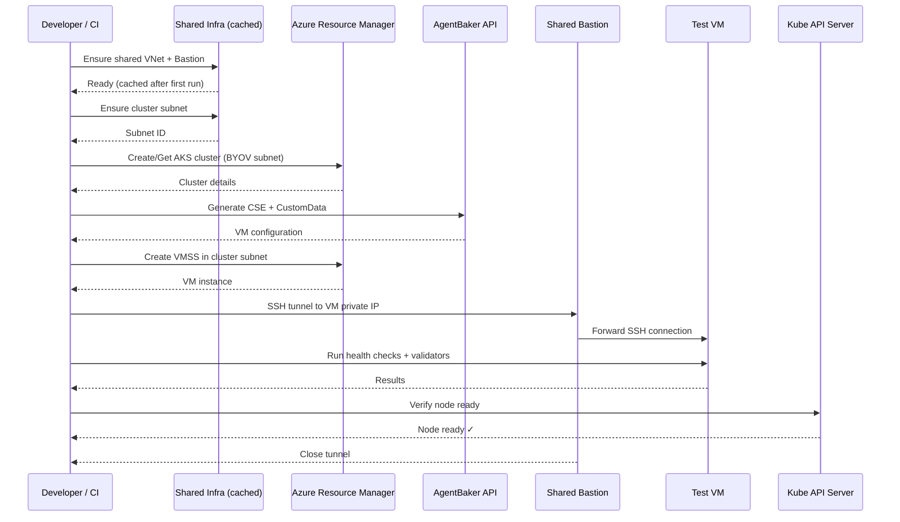

# AgentBaker E2E Testing

This directory contains files related to the AgentBaker E2E testing framework.

## Overview

AgentBaker E2E tests verify that node bootstrapping artifacts generated by the AgentBaker API are
correct and capable of integrating Azure VMs into Azure Kubernetes Service (AKS) clusters.

The E2E scenario runner is in this package.
From a high-level, for each scenario,

1. a new VMSS containing a single VM will be created.
2. CSE and custom data are generated, which will then be applied to the new VM so it can bootstrap and register with the
   AKS cluster apiserver.
3. Liveness and health checks and then run to make sure the new VM's kubelet is posting NodeReady, and that workload
   pods can successfully be scheduled and run on the new node.

To write an E2E scenario,

- Choose a test cluster. The cluster definitions are in [cache.go](cache.go).
    - ClusterKubenet
    - ClusterAzureNetwork
    - ClusterAzureOverlayNetwork
    - ClusterAzureOverlayNetworkDualStack
    - ClusterCiliumNetwork
    - ClusterLatestKubernetesVersion
    - ClusterAzureBootstrapProfileCache (private ACR)
    - ClusterAzureNetworkIsolated (no internet access)
- use `NodeBootstrappingConfiugration` (`nbc`) to setup your scenario. it is used to invoke the primary
  node-bootstrapping
  API [GetLatestNodeBootstrapping](https://github.com/Azure/AgentBaker/blob/2e730b5a498c5be9b082d912fd08ac9346582db9/pkg/agent/bakerapi.go#L14).
  to modify agentpool properties, usually you need to set both`nbc.containerService.properties.AgentPoolProfiles[0].xxx`
  as well as `nbc.agentPoolProfile`. It is because when RP invokes AgentBaker, it will set the properties in this way
  and in e2e we follow the pattern.
- use `VMConfigMutator` to set VMSS properties such as SKU when needed.
  Read [vmss.go](vmss.go) for other configuration values.
  it is necessary to set `nbc.agentPoolProfile.VMSize` to match the VMSS SKU if you choose to change.
- use `Validator` to include your own verification of the VM's live state, such as file existsnce, sysctl settings, etc.

## Infrastructure Architecture

All E2E clusters share a single VNet and Azure Bastion in the `abe2e-{location}` resource group. This
avoids creating a per-cluster Bastion (~10 min each) and ensures all clusters are reachable from a
single SSH entry point.


```mermaid
graph TB
    subgraph RG["abe2e-{location} Resource Group"]
        subgraph VNET["abe2e-shared-vnet (10.0.0.0/8)"]
            BASTION_SUBNET["AzureBastionSubnet<br/>10.0.0.0/26"]
            FW_SUBNET["AzureFirewallSubnet<br/>10.0.1.0/24"]
            PE_SUBNET["abe2e-pe-subnet<br/>10.0.2.0/24<br/>(shared private endpoints)"]
            KUBENET_SUBNET["aks-subnet-abe2e-kubenet-v5<br/>10.x.x.0/20"]
            AZNET_SUBNET["aks-subnet-abe2e-azure-network-v4<br/>10.x.x.0/20"]
            MORE_SUBNETS["... more cluster subnets"]
        end
        BASTION["abe2e-shared-bastion<br/>(Standard SKU, Tunneling)"]
        FIREWALL["abe2e-fw<br/>(Azure Firewall)"]
        IDENTITY["abe2e-cluster-identity<br/>(User-Assigned MSI)"]
        PE_ACR["PE-for-abe2eprivate{location}<br/>PE-for-abe2eprivatenonanon{location}<br/>(shared ACR private endpoints)"]
        DNS_ZONE["privatelink.azurecr.io<br/>(Private DNS Zone)"]
        ACR_ANON["abe2eprivate{location}<br/>(Private ACR)"]
        ACR_NONANON["abe2eprivatenonanon{location}<br/>(Non-anonymous Private ACR)"]
    end

    subgraph MC_KUBENET["MC_abe2e-kubenet-v5 Resource Group"]
        VMSS_K["VMSS (system pool)"]
        VMSS_K_TEST["VMSS (test VMs)"]
        RT_K["Route Table<br/>(pod routes + firewall)"]
    end

    subgraph MC_NI["MC_abe2e-azure-networkisolated-v2 Resource Group"]
        VMSS_NI["VMSS (system pool)"]
        NSG_NI["NSG<br/>(blocks internet)"]
    end

    BASTION --> BASTION_SUBNET
    FIREWALL --> FW_SUBNET
    PE_ACR --> PE_SUBNET
    DNS_ZONE -.->|VNet link| VNET
    VMSS_K --> KUBENET_SUBNET
    RT_K -.->|associated| KUBENET_SUBNET
    VMSS_NI --> AZNET_SUBNET
    NSG_NI -.->|associated| AZNET_SUBNET

    DEV["Developer / CI"]
    DEV -->|SSH via tunnel| BASTION
    BASTION -->|"connects to any VM<br/>in shared VNet"| VMSS_K_TEST
```

### Shared Infrastructure Setup

The shared infrastructure is created **automatically** on first test run via cached idempotent
functions — no separate setup script is needed.

| Resource | Name | Details |
|----------|------|---------|
| VNet | `abe2e-shared-vnet` | `10.0.0.0/8` — supports ~4096 `/20` cluster subnets |
| Bastion | `abe2e-shared-bastion` | Standard SKU with tunneling enabled for native SSH |
| Bastion Subnet | `AzureBastionSubnet` | `10.0.0.0/26` (required by Azure Bastion) |
| Firewall Subnet | `AzureFirewallSubnet` | `10.0.1.0/24` |
| PE Subnet | `abe2e-pe-subnet` | `10.0.2.0/24` — hosts shared private endpoints for ACRs |
| Identity | `abe2e-cluster-identity` | User-assigned MSI with Network Contributor on the VNet |
| Private DNS Zone | `privatelink.azurecr.io` | Shared zone in `abe2e-{location}` RG, linked to the VNet |

Each AKS cluster gets its own `/20` subnet (4091 usable IPs) in the shared VNet. The subnet is
named `aks-subnet-{clusterName}`. CIDRs are auto-allocated from a hash of the cluster name to
avoid collisions.

### Cluster Types

All clusters use BYOV (Bring Your Own VNet) with the shared VNet. They differ in networking
plugin, isolation level, and whether private ACR is needed.

| Cluster | Network Plugin | Special Features | Private ACR |
|---------|---------------|-----------------|:-----------:|
| `abe2e-kubenet-v5` | Kubenet | Basic pod routing via route table | ❌ |
| `abe2e-azure-network-v4` | Azure CNI | Pods get IPs from subnet (MaxPods=30) | ❌ |
| `abe2e-azure-overlay-network-v4` | Azure CNI Overlay | Pods in virtual overlay, not subnet | ❌ |
| `abe2e-azure-overlay-dualstack-v4` | Azure CNI Overlay | IPv4+IPv6 dual-stack | ❌ |
| `abe2e-cilium-network-v4` | Azure CNI + Cilium | eBPF dataplane, replaces kube-proxy | ❌ |
| `abe2e-latest-kubernetes-version-v2` | Kubenet | Auto-discovers latest GA K8s version | ❌ |
| `abe2e-azure-bootstrapprofile-cache-v2` | Azure CNI | Bootstrap artifact caching from private ACR | ✅ |
| `abe2e-azure-networkisolated-v2` | Azure CNI | NSG blocks all internet except allowlist | ✅ |

**Network-isolated cluster** adds an NSG to its subnet that blocks all outbound traffic except
`management.azure.com`, the cluster FQDN, and `packages.aks.azure.com`. Private endpoints for
the ACRs are in the shared PE subnet, with DNS records in the shared `privatelink.azurecr.io` zone.

### How It Works

1. **`CachedEnsureSharedInfra`** — runs once per location per test run. Creates/verifies the shared
   VNet, Bastion, Firewall, PE subnet, and user-assigned identity.
2. **`configureSharedVNet`** — tags the cluster model for BYOV. After the cluster name is hashed,
   **`CachedEnsureClusterSubnet`** creates the cluster's dedicated `/20` subnet.
3. **`prepareCluster`** — creates/gets the AKS cluster, then runs a DAG of parallel tasks:
   - Bastion lookup (shared)
   - Firewall route table (non-isolated clusters)
   - NSG association (network-isolated cluster)
   - Private DNS zone + VNet link (if ACR needed, runs once before ACR tasks)
   - Private ACR + PE creation (bootstrapprofile-cache and network-isolated)
   - VMSS garbage collection
   - Debug daemonsets
4. SSH to test VMs goes through the shared Bastion, which can reach any VM in the VNet.

### Test Flow


```mermaid
sequenceDiagram
    participant CI as Developer / CI
    participant Infra as Shared Infra (cached)
    participant ARM as Azure Resource Manager
    participant AB as AgentBaker API
    participant Bastion as Shared Bastion
    participant VM as Test VM
    participant K8s as Kube API Server

    CI->>Infra: Ensure shared VNet + Bastion
    Infra-->>CI: Ready (cached after first run)

    CI->>Infra: Ensure cluster subnet
    Infra-->>CI: Subnet ID

    CI->>ARM: Create/Get AKS cluster (BYOV subnet)
    ARM-->>CI: Cluster details

    CI->>AB: Generate CSE + CustomData
    AB-->>CI: VM configuration

    CI->>ARM: Create VMSS in cluster subnet
    ARM-->>CI: VM instance

    CI->>Bastion: SSH tunnel to VM private IP
    Bastion->>VM: Forward SSH connection

    CI->>VM: Run health checks + validators
    VM-->>CI: Results

    CI->>K8s: Verify node ready
    K8s-->>CI: Node ready ✓

    Bastion-->>CI: Close tunnel
```

## Running Locally

**Note: if you have changed code or artifacts used to generate custom data or custom script extension payloads, you
should set `DISABLE_SCRIPTLESS=true` in `.env`. Otherwise scriptless provisioning only uses scripts that are built into VHD.**

Run the E2E suite with `e2e-local.sh`. This script starts the E2E CLI.

Use `go run ./cmd/e2e run --help` to see runner configuration. CLI flags are canonical. Existing environment variables are aliases.

Azure credentials and infrastructure configuration remain in [config.go](config/config.go). You can put these values in an `.env` file.

### Running Specific Tests

Use `--tags` to select scenarios by tag. Separate multiple tags with commas. Tag names are case-insensitive.

Example:

```bash
./e2e-local.sh --tags "os=ubuntu,arch=amd64,wasm=false,gpu=false,imagename=2404gen2containerd"
```

Use `--skip-tags` to exclude scenarios. Existing `TAGS_TO_RUN` and `TAGS_TO_SKIP` values remain compatible.

To run one scenario, give its name to the script:

```bash
./e2e-local.sh AzureLinuxV2
```

Give more than one name to run multiple scenarios:

```bash
./e2e-local.sh AzureLinuxV2 Ubuntu2204
```

### Debugging

Set `KEEP_VMSS=true` to retain bootstrapped VMs for debugging. Setting this will also have the VM's private SSH key
included in each scenario's log bundle. When using this flag, please ensure to run only test you need to debug, as the
VMs will not be
deleted after the test run.

### Running Tests Manually

Run the CLI directly to set runner flags:

```bash
go run ./cmd/e2e run --parallel 100 --timeout 90m
```

Use `go run ./cmd/e2e list` to list the registered scenario entry points.

### Result Files

The runner writes each scenario attempt to a separate file under `LOGGING_DIR`.

The runner writes plain-text scenario logs. It does not write a JUnit file by default. ADO enables JUnit with `--junit-file`.

ADO uses `--output grouped`. Local runs stream prefixed logs when three or fewer scenario entry points are selected.

### Cleanup

Azure resources are deleted periodically by an external garbage collector. Locally stopped tests attempt a graceful
shutdown to clean up resources. Old VMs are deleted on startup unless created with `KEEP_VMSS=true`.

## Package Structure

The executable entry point is [cmd/e2e/main.go](cmd/e2e/main.go). The scenario runner and definitions are in this package.

The other directories contain helper packages and embedded resources.

## E2E VHDs.

Node images are pushed to Shared Image Gallery (SIG). Each image is tagged with branch name and build id.
By default E2E tests use latest version of images from SIG with `branch=refs/heads/main` tag.

## Using VHD Images from Custom ADO Builds

Set `SIG_VERSION_TAG_NAME` and `SIG_VERSION_TAG_VALUE` to specify custom VHD builds:

```bash
SIG_VERSION_TAG_NAME=buildId SIG_VERSION_TAG_VALUE=123456789 TAGS_TO_RUN="os=ubuntu2204" ./e2e-local.sh
```

### Registering New VHD SKUs

When adding tests for a new VHD image, ensure to add a delete-lock to prevent the garbage collector from deleting the
image version.

## Scenarios

E2E scenarios can be configured with VMSS configuration mutators that change/set properties on the VMSS model used
to deploy the new VM to be bootstrapped. This is primarily useful when testing out different VM SKUs, especially for
GPU-enabled scenarios which affect which code paths AgentBaker will use to generate CSE and custom data

Further, in order to support E2E scenarios which test different underlying AKS cluster configurations, such as the
cluster's network plugin, each E2E scenario uses one of the predefined clusters. Same cluster can be reused in different
test runs. If cluster doesn't exist a new one will be created automatically.

Lastly, E2E scenarios also consist of a list of live VM validators. Each live VM validator consists of a description, a
bash command which will actually be run on the newly bootstrapped VM, and an "asserter" function that will perform
assertions on the contents of both the stdout and stderr streams that result from the execution of the command. The
validators can be used to assert on numerous types of properties of the live VM, such as the live file system and kernel
state.

## Log Collection

Each E2E scenario will generate its own logs after execution. Currently, these logs consist of:

- `cluster-provision.log` - CSE execution log, retrieved from `/var/log/azure/aks/cluster-provision.log` (collected in
  success and CSE failure cases)
- `kubelet.log` - the kubelet systemd unit's logs retrived by running `journalctl -u kubelet` on the VM after
  bootstrapping has finished (collected in success and CSE failure cases)
- `vmssId.txt` - a single line text file containing the unique resource ID of the VMSS created by the respective
  scenario, mainly collected for the purposes of posthoc resource deletion (collected in all cases where the VMSS is
  able to be created)

These logs will be uploaded in a bundle of the format:

```bash
└── scenario-logs
    └── <scenario>
        ├── cluster-provision.log
        ├── kubelet.log
        ├── vmssId.txt
```

## Coverage report

After a PR is created in AgentBaker's repo on GitHub, a pipeline calculating code coverage changes will automatically
run.

We are utilizing [coveralls](https://coveralls.io/) to display the coverage report. The coverage report will be
available in the PR's description.
You can also view previous runs for the AgentBaker repo [here](https://coveralls.io/github/Azure/AgentBaker).

We calculate code coverage for both unit tests and E2E tests.

### E2E coverage report

To generate E2E coverage reports, we use code [coverage changes](https://go.dev/blog/integration-test-coverage)
introduced in Go 1.20.

Coverage report is generated by running AgentBaker's API server locally as a binary created with the -cover flag.
E2E tests are then ran against that binary.

The following packages are used during calculation of coverage for E2E tests:

````
- github.com/Azure/agentbaker/apiserver
- github.com/Azure/agentbaker/cmd
- github.com/Azure/agentbaker/cmd/starter
- github.com/Azure/agentbaker/pkg/agent
- github.com/Azure/agentbaker/pkg/agent/datamodel
- github.com/Azure/agentbaker/pkg/templates
````

#### Generating E2E coverage report locally

You can generate an E2E coverage report while running the E2E tests locally.
To do so, follow the steps below:

1. Build the AgentBaker server binary with -cover flag:

```bash
  cd cmd
  go build -cover -o baker -covermode count
  GOCOVERDIR=covdatafiles ./baker start &
```

2. Create directory for coverage report files

```bash
  mkdir -p covdatafiles
```

3. Run the binary

```bash
  GOCOVERDIR=covdatafiles ./baker start &
```

4. Run the E2E tests locally

```bash
  /bin/bash e2e/e2e-local.sh
```

5. Stop the binary - once the tests finish executing, you have to stop the binary with exit code 0 to generate the
   report.
   See the docs [here](https://go.dev/testing/coverage/#panicprof).

```bash
  kill $(pgrep baker)
```

6. Display the coverage report within the terminal

```bash
  go tool covdata percent -i=./cmd/somedata
```
