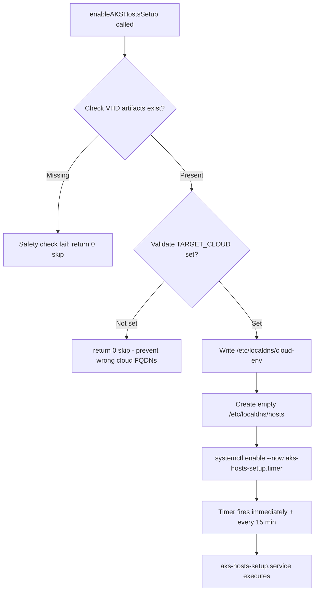
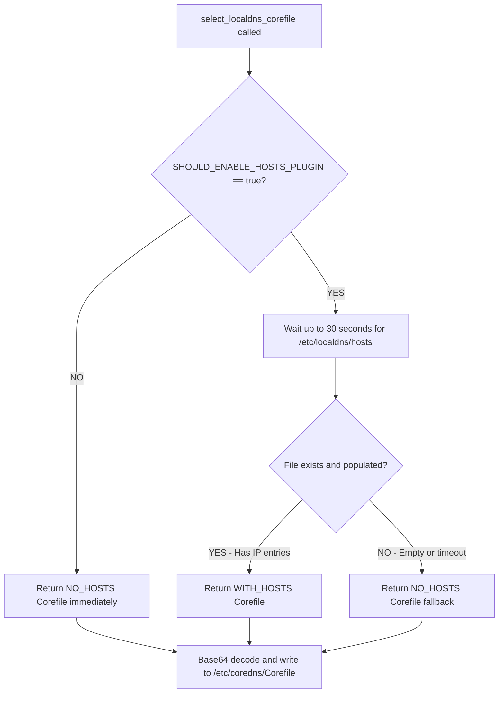

# LocalDNS Hosts Plugin Flow Diagram

## Legend
- 🟦 = Non-Scriptless (Traditional CSE)
- 🟩 = Scriptless (aks-node-controller)
- 🟨 = Shared (Both paths)

---

## Input: User Configuration

**AgentPoolProfile Configuration:**
```go
AgentPoolProfile.LocalDNSProfile.EnableHostsPlugin = true
```

**Helper Method:** `pkg/agent/datamodel/types.go:2494`
```go
func (a *AgentPoolProfile) ShouldEnableHostsPlugin() bool {
    return a.ShouldEnableLocalDNS() && a.LocalDNSProfile.EnableHostsPlugin
}
```

---

## Configuration Generation (Diverges)

### 🟦 Non-Scriptless Path (Traditional CSE)

**Location:** `pkg/agent/baker.go:1225-1240`

**Process:** `GetNodeBootstrappingCmd()` generates 3 template variables:

1. **`SHOULD_ENABLE_HOSTS_PLUGIN`** = `"true"` or `"false"`
2. **`LOCALDNS_GENERATED_COREFILE`** (WITH hosts plugin)
3. **`LOCALDNS_GENERATED_COREFILE_NO_HOSTS`** (WITHOUT hosts plugin)

**CoreDNS Template Generation:**
- `generateLocalDNSCoreFile(includeHostsPlugin: true)` → Line 1861
- `generateLocalDNSCoreFile(includeHostsPlugin: false)` → Line 1878

**Template Replacement:**
- Direct Go template replacement in CSE script generation
- Variables embedded directly into bash scripts

---

### 🟩 Scriptless Path (aks-node-controller)

**Proto Definition:** `aks-node-controller/pkg/gen/aksnodeconfig/v1/localdns_config.pb.go:42`
```go
EnableHostsPlugin bool `protobuf:"varint,6,opt,name=enable_hosts_plugin"`
```

**Parser Helpers:** `aks-node-controller/parser/helper.go:809`
```go
func shouldEnableHostsPlugin(aksnodeconfig *aksnodeconfigv1.Configuration) string {
    return fmt.Sprintf("%v", shouldEnableLocalDns(aksnodeconfig) == "true" &&
           aksnodeconfig.GetLocalDnsProfile().GetEnableHostsPlugin())
}
```

**Corefile Template:** `aks-node-controller/parser/templates/localdns.toml.gtpl`
- TOML template with conditional hosts plugin blocks

**Environment Variables:** `aks-node-controller/parser/parser.go:175-179`
```go
"SHOULD_ENABLE_HOSTS_PLUGIN":           shouldEnableHostsPlugin(config),
"LOCALDNS_GENERATED_COREFILE":          getLocalDnsCorefileBase64WithHostsPlugin(config, true),
"LOCALDNS_GENERATED_COREFILE_NO_HOSTS": getLocalDnsCorefileBase64WithHostsPlugin(config, false),
```

**Variable Injection:**
- Proto → Environment variables → Sourced by CSE scripts

---

## 🟨 Runtime Execution (Both Paths Converge)

**Location:** `parts/linux/cloud-init/artifacts/`

### Step 1: Variables Available in CSE

**File:** `cse_cmd.sh:186-190`

**Purpose:** Declares three hosts plugin environment variables used by CSE provisioning scripts:
- `SHOULD_ENABLE_HOSTS_PLUGIN` - Boolean flag indicating user's intent to enable hosts plugin
- `LOCALDNS_GENERATED_COREFILE` - Base64-encoded Corefile WITH hosts plugin block
- `LOCALDNS_GENERATED_COREFILE_NO_HOSTS` - Base64-encoded Corefile WITHOUT hosts plugin block

**Why both Corefiles?** Both configs are pre-generated to enable runtime fallback for graceful degradation. Even on new VHDs with all artifacts present, runtime conditions may prevent `/etc/localdns/hosts` population: DNS resolution failures, missing TARGET_CLOUD, systemd timer delays, or network issues during boot. Rather than failing provisioning, `select_localdns_corefile()` waits up to 30 seconds for the hosts file, then falls back to the NO_HOSTS variant if the file is missing or empty. This ensures nodes always provision successfully with best-effort local DNS caching rather than hard dependency on it.

```bash
SHOULD_ENABLE_HOSTS_PLUGIN="true"  # or "false"
LOCALDNS_GENERATED_COREFILE="<base64-encoded-with-hosts>"
LOCALDNS_GENERATED_COREFILE_NO_HOSTS="<base64-encoded-no-hosts>"
```

---

### Step 2: CSE Main Execution

**File:** `cse_main.sh:305-319`

```bash
# 1. Call enableAKSHostsSetup to prepare the hosts file infrastructure
logs_to_events "AKS.CSE.enableAKSHostsSetup" enableAKSHostsSetup

# 2. Select which Corefile to use based on actual runtime conditions
LOCALDNS_COREFILE_TO_USE=$(select_localdns_corefile \
    "${SHOULD_ENABLE_HOSTS_PLUGIN}" \
    "${LOCALDNS_GENERATED_COREFILE}" \
    "${LOCALDNS_GENERATED_COREFILE_NO_HOSTS}" \
    "/etc/localdns/hosts")
```

---

### Step 3: enableAKSHostsSetup() Function

**File:** `cse_config.sh:1284-1340`

**Purpose:** Sets up the infrastructure for populating `/etc/localdns/hosts`

**Flow:**



**Key Operations:**

1. **Validate VHD artifacts exist:**
   - `/opt/azure/containers/aks-hosts-setup.sh` (script must exist and be executable)
   - `/etc/systemd/system/aks-hosts-setup.service` (systemd service must exist)
   - `/etc/systemd/system/aks-hosts-setup.timer` (systemd timer must exist)
   - **If missing?** → Return 0 (graceful skip - this should not happen on properly built VHDs but provides safety)

2. **Validate TARGET_CLOUD:**
   - Must be set to determine which cloud-specific FQDNs to resolve
   - If not set → Return 0 (graceful skip to prevent caching wrong cloud's FQDNs)

3. **Write cloud environment file:**
   - Creates `/etc/localdns/cloud-env` with `TARGET_CLOUD` variable
   - Used by timer-triggered aks-hosts-setup.sh runs

4. **Create empty hosts file:**
   - Creates `/etc/localdns/hosts` for CoreDNS to watch
   - Will be populated by the timer asynchronously

5. **Enable and start timer:**
   - `systemctl enable --now aks-hosts-setup.timer`
   - Timer fires immediately once (OnBootSec=0), then every 15 minutes
   - If this fails, hosts file won't be populated → fallback to NO_HOSTS Corefile

---

### Step 4: select_localdns_corefile() Function

**File:** `cse_helpers.sh:1316-1365`

**Purpose:** Chooses between WITH_HOSTS and NO_HOSTS Corefile based on runtime conditions

**Flow:**



**Key Logic:**

1. **Check flag:** `SHOULD_ENABLE_HOSTS_PLUGIN == "true"?`
   - **NO** → Return `NO_HOSTS` Corefile immediately
   - **YES** → Proceed to file validation

2. **Wait for hosts file:**
   - Wait up to 30 seconds for `/etc/localdns/hosts` to exist
   - Check if file has actual IP entries using grep pattern:
     ```bash
     grep -E '^[0-9a-fA-F.:]+[[:space:]]+[^[:space:]]+' /etc/localdns/hosts
     ```

3. **Decision:**
   - **File has IP entries** → Return `WITH_HOSTS` Corefile
   - **File empty/missing/timeout** → Return `NO_HOSTS` Corefile (fallback)
   - **Fallback reasons:**
     - enableAKSHostsSetup() skipped due to missing TARGET_CLOUD or artifact validation failure
     - aks-hosts-setup.sh couldn't resolve any FQDNs (DNS failures)
     - Systemd timer delayed or failed to fire within 30 seconds
     - Network issues during boot preventing DNS resolution

4. **Write selected Corefile:**
   - Base64 decode the selected Corefile
   - Write to `/etc/coredns/Corefile`

---

### Step 5: aks-hosts-setup.sh Execution

**File:** `parts/linux/cloud-init/artifacts/aks-hosts-setup.sh`

**Purpose:** Resolves DNS records for critical AKS FQDNs and populates `/etc/localdns/hosts`

**Trigger:** Executed by `aks-hosts-setup.service` when `aks-hosts-setup.timer` fires

**Process:**

1. **Read cloud environment:**
   - Source `/etc/localdns/cloud-env` to get `TARGET_CLOUD`

2. **Select cloud-specific FQDNs:**
   - **AzurePublicCloud:** `mcr.microsoft.com`, `packages.aks.azure.com`, `login.microsoftonline.com`, `management.azure.com`, `acs-mirror.azureedge.net`, etc.
   - **AzureChinaCloud:** `mcr.azk8s.cn`, `login.chinacloudapi.cn`, `management.chinacloudapi.cn`, etc.
   - **AzureUSGovernmentCloud:** Government-specific endpoints
   - **USNatCloud / USSecCloud / AzureStackCloud:** Environment-specific endpoints

3. **Resolve DNS records:**
   - Use `getent ahosts` or `dig` to resolve A and AAAA records
   - For each FQDN, extract IPv4 and IPv6 addresses

4. **Validate entries:**
   - Skip any entries with empty IP addresses
   - Ensure proper format: `<IP> <FQDN>`

5. **Atomic file write:**
   - Write to temporary file: `/etc/localdns/hosts.tmp`
   - Validate temp file content
   - Atomic rename: `mv /etc/localdns/hosts.tmp /etc/localdns/hosts`
   - **Note:** CoreDNS automatically picks up changes (no explicit reload needed)

**Timer Schedule:**
- **OnBootSec=0** → Fires immediately on boot
- **OnUnitActiveSec=15min** → Fires every 15 minutes thereafter

---

### Step 6: CoreDNS Runtime

**File:** `parts/linux/cloud-init/artifacts/localdns.service`

**With Hosts Plugin Enabled:**

The Corefile includes a hosts plugin block for each DNS override domain:

```
example.com:53 {
    hosts /etc/localdns/hosts {
        fallthrough
    }
    forward . <upstream DNS IPs>
    cache 30
    loop
    reload
    loadbalance
}
```

**Behavior:**
1. CoreDNS receives DNS query for `mcr.microsoft.com`
2. Checks `/etc/localdns/hosts` first
3. If found → Returns cached IP immediately (fast path)
4. If not found → `fallthrough` to upstream DNS via `forward` plugin
5. Cache result for 30 seconds

**Without Hosts Plugin:**

```
example.com:53 {
    forward . <upstream DNS IPs>
    cache 30
    loop
    reload
    loadbalance
}
```

All queries go directly to upstream DNS (no local caching of critical FQDNs).

---

## Decision Tree Summary

### If `EnableHostsPlugin == true`:

1. ✅ Generate **both** Corefiles (WITH and WITHOUT hosts plugin)
2. ✅ Set `SHOULD_ENABLE_HOSTS_PLUGIN="true"`
3. ✅ During CSE: Call `enableAKSHostsSetup()` unconditionally
   - **Runtime conditions OK?**
     - ✅ Artifacts exist (aks-hosts-setup.sh, systemd units)
     - ✅ TARGET_CLOUD is set
     - → Create `/etc/localdns/cloud-env`
     - → Create `/etc/localdns/hosts` (empty initially)
     - → Enable `aks-hosts-setup.timer`
   - **Runtime conditions fail?** (missing TARGET_CLOUD, artifacts validation fails)
     - → Skip setup (return 0)
     - → Will fall back to NO_HOSTS Corefile later
4. ✅ `select_localdns_corefile()` waits for hosts file population
   - **File populated with IPs within 30s?** → Use WITH_HOSTS Corefile ✅
   - **Timeout, empty, or missing?** → Fall back to NO_HOSTS Corefile ⚠️
   - **Reasons for fallback:**
     - TARGET_CLOUD not set (enableAKSHostsSetup skipped)
     - DNS resolution failed (aks-hosts-setup.sh couldn't resolve FQDNs)
     - Timer delayed or failed to fire in time
     - Systemd issues

### If `EnableHostsPlugin == false`:

1. ✅ Generate **only** NO_HOSTS Corefile
2. ✅ Set `SHOULD_ENABLE_HOSTS_PLUGIN="false"`
3. ❌ `enableAKSHostsSetup()` still runs but no-op (artifacts won't exist if feature disabled)
4. ✅ `select_localdns_corefile()` returns NO_HOSTS Corefile immediately (no waiting)

---

## Key Differences: Scriptless vs Non-Scriptless

| Aspect | 🟦 Non-Scriptless | 🟩 Scriptless |
|--------|------------------|---------------|
| **Configuration Source** | `pkg/agent/baker.go` template functions | `aks-node-controller` proto → parser helpers |
| **Corefile Template** | Go `text/template` in `baker.go` (line 1899-1960) | TOML template `localdns.toml.gtpl` |
| **Variable Injection** | Direct Go template replacement in CSE script generation | Proto → Environment variables → Sourced by CSE scripts |
| **Runtime Behavior** | ✅ **IDENTICAL** - Both execute same bash scripts | ✅ **IDENTICAL** - Both execute same bash scripts |

**Key Point:** Both paths produce the same environment variables and execute identical bash scripts at runtime (`cse_main.sh` → `enableAKSHostsSetup` → `select_localdns_corefile`).

---

## Complete Flow Diagram

```
┌───────────────────────────────────────────────────────────────┐
│                    User Configuration                         │
│  AgentPoolProfile.LocalDNSProfile.EnableHostsPlugin = true    │
└───────────────────────────┬───────────────────────────────────┘
                            │
        ┌───────────────────┴───────────────────┐
        │                                       │
        ▼                                       ▼
┌───────────────────┐               ┌───────────────────┐
│ 🟦 Non-Scriptless │               │  🟩 Scriptless    │
│                   │               │                   │
│ pkg/agent/        │               │ aks-node-         │
│ baker.go          │               │ controller/       │
│                   │               │ parser/           │
│ Generate vars:    │               │                   │
│ - SHOULD_ENABLE_  │               │ Generate vars:    │
│   HOSTS_PLUGIN    │               │ - SHOULD_ENABLE_  │
│ - LOCALDNS_       │               │   HOSTS_PLUGIN    │
│   GENERATED_      │               │ - LOCALDNS_       │
│   COREFILE        │               │   GENERATED_      │
│ - LOCALDNS_       │               │   COREFILE        │
│   GENERATED_      │               │ - LOCALDNS_       │
│   COREFILE_       │               │   GENERATED_      │
│   NO_HOSTS        │               │   COREFILE_       │
│                   │               │   NO_HOSTS        │
└────────┬──────────┘               └────────┬──────────┘
         │                                   │
         └───────────────┬───────────────────┘
                         │
                         ▼
         ┌───────────────────────────────────┐
         │  🟨 VM Provisioning (CSE)         │
         │  parts/linux/cloud-init/          │
         │  artifacts/                       │
         └───────────────┬───────────────────┘
                         │
                         ▼
         ┌───────────────────────────────────┐
         │  cse_cmd.sh (line 186-190)        │
         │  Variables sourced into shell     │
         └───────────────┬───────────────────┘
                         │
                         ▼
         ┌───────────────────────────────────┐
         │  cse_main.sh (line 305-319)       │
         │                                   │
         │  1. enableAKSHostsSetup()         │
         │  2. select_localdns_corefile()    │
         └────────┬──────────────┬───────────┘
                  │              │
         ┌────────▼────────┐     │
         │ enableAKS       │     │
         │ HostsSetup()    │     │
         │                 │     │
         │ • Check VHD has │     │
         │   artifacts     │     │
         │ • Write cloud-  │     │
         │   env file      │     │
         │ • Create empty  │     │
         │   hosts file    │     │
         │ • Enable timer  │     │
         └────────┬────────┘     │
                  │              │
                  └──────┬───────┘
                         │
                         ▼
         ┌───────────────────────────────────┐
         │ select_localdns_corefile()        │
         │ (Choose Corefile)                 │
         └───────────────┬───────────────────┘
                         │
                         ▼
         ┌───────────────────────────────────┐
         │ Write selected Corefile to        │
         │ /etc/coredns/Corefile             │
         └───────────────┬───────────────────┘
                         │
                         ▼
         ┌───────────────────────────────────┐
         │ Start localdns.service            │
         │ (CoreDNS with selected config)    │
         └───────────────────────────────────┘
```

---

## enableAKSHostsSetup() Detailed Flow

**File:** `cse_config.sh:1284-1340`

### Decision Logic

```
START: enableAKSHostsSetup()
  │
  ├─> Check: Do systemd units exist?
  │   (/etc/systemd/system/aks-hosts-setup.service)
  │   (/etc/systemd/system/aks-hosts-setup.timer)
  │
  ├─> NO → Safety check: Artifacts missing (shouldn't happen on proper VHD)
  │   └─> return 0 (graceful skip to prevent hard failure)
  │       └─> Later: select_localdns_corefile() will timeout
  │           and fall back to NO_HOSTS Corefile
  │
  └─> YES → Artifacts present
      │
      ├─> Check: Is /opt/azure/containers/aks-hosts-setup.sh executable?
      │   └─> NO → return 0 (safety check)
      │
      ├─> Check: Is TARGET_CLOUD set?
      │   └─> NO → return 0 (skip - prevents caching wrong cloud FQDNs)
      │
      └─> YES → All conditions met, proceed with setup:
          │
          ├─> 1. Write /etc/localdns/cloud-env
          │      Content: TARGET_CLOUD=<value>
          │      (Used by timer-triggered aks-hosts-setup.sh runs)
          │
          ├─> 2. Create /etc/localdns/hosts (empty file)
          │      CoreDNS will watch this file
          │      (Will be populated asynchronously by timer)
          │
          └─> 3. Enable and start timer
              systemctl enable --now aks-hosts-setup.timer
              │
              ├─> If systemctl fails → Hosts file won't be populated
              │   └─> Fallback to NO_HOSTS Corefile later
              │
              └─> Success → Timer fires IMMEDIATELY (OnBootSec=0)
                  then every 15 minutes (OnUnitActiveSec=15min)
```

---

## select_localdns_corefile() Detailed Flow

**File:** `cse_helpers.sh:1316-1365`

### Decision Logic

```
START: select_localdns_corefile()
  │
  ├─> Input parameters:
  │   - should_enable_hosts_plugin ("true" or "false")
  │   - corefile_with_hosts (base64)
  │   - corefile_no_hosts (base64)
  │   - hosts_file_path (/etc/localdns/hosts)
  │
  ├─> Check: should_enable_hosts_plugin == "true"?
  │
  ├─> NO → Return corefile_no_hosts immediately
  │
  └─> YES → Wait for hosts file to be populated:
      │
      ├─> Loop for up to 30 seconds:
      │   │
      │   ├─> Check: Does /etc/localdns/hosts exist?
      │   │   └─> NO → sleep 5 seconds, retry
      │   │
      │   └─> YES → Check: Does file have IP entries?
      │       │   (grep for pattern: ^[0-9a-fA-F.:]+[[:space:]]+)
      │       │
      │       ├─> YES → BREAK LOOP, use WITH_HOSTS ✅
      │       └─> NO → sleep 5 seconds, retry
      │
      ├─> After loop completes (30s timeout):
      │
      ├─> Final check: Does hosts file have IP entries?
      │
      ├─> YES → Return corefile_with_hosts ✅
      │
      └─> NO → Return corefile_no_hosts (fallback) ⚠️
          │
          ├─> Possible reasons for fallback:
          │   • enableAKSHostsSetup() skipped (TARGET_CLOUD not set or artifacts missing)
          │   • aks-hosts-setup.sh couldn't resolve any FQDNs (DNS failures)
          │   • Timer delayed or failed to fire within 30 seconds
          │   • Network issues preventing DNS resolution
          │
          └─> Log: "WARNING: /etc/localdns/hosts is empty or missing"
```

**Why 30 seconds?**
- Allows `aks-hosts-setup.timer` to fire on boot (OnBootSec=0)
- Gives `aks-hosts-setup.sh` time to resolve DNS records (typically 18-36s for 6 FQDNs)
- Prevents blocking provisioning indefinitely if setup fails
- Balance between waiting for success and not delaying node provisioning
- Prevents race condition between CSE and timer execution

---

## aks-hosts-setup.sh Script Flow

**File:** `parts/linux/cloud-init/artifacts/aks-hosts-setup.sh`

### Execution Flow

```
START: aks-hosts-setup.sh
  │
  ├─> 1. Source /etc/localdns/cloud-env
  │      Get TARGET_CLOUD variable
  │
  ├─> 2. Select cloud-specific FQDN list based on TARGET_CLOUD:
  │   │
  │   ├─> AzurePublicCloud:
  │   │   - mcr.microsoft.com
  │   │   - packages.aks.azure.com
  │   │   - login.microsoftonline.com
  │   │   - management.azure.com
  │   │   - acs-mirror.azureedge.net
  │   │   - <more FQDNs...>
  │   │
  │   ├─> AzureChinaCloud:
  │   │   - mcr.azk8s.cn
  │   │   - login.chinacloudapi.cn
  │   │   - management.chinacloudapi.cn
  │   │   - <more FQDNs...>
  │   │
  │   └─> Other clouds: (Government, USNat, USSec, Stack)
  │       - Cloud-specific endpoints
  │
  ├─> 3. For each FQDN, resolve DNS records:
  │   │
  │   ├─> Resolve A records (IPv4):
  │   │   getent ahosts <FQDN> | grep STREAM | awk '{print $1 " " FQDN}'
  │   │
  │   └─> Resolve AAAA records (IPv6):
  │       dig +short AAAA <FQDN> | awk '{print $1 " " FQDN}'
  │
  ├─> 4. Validate each entry:
  │   ├─> Skip if IP is empty
  │   └─> Format: <IP> <FQDN>
  │
  ├─> 5. Write to temp file:
  │      /etc/localdns/hosts.tmp
  │
  ├─> 6. Validate temp file has content
  │
  └─> 7. Atomic rename:
      mv /etc/localdns/hosts.tmp /etc/localdns/hosts
      (CoreDNS automatically picks up changes)
```

---

## Runtime Fallback Scenarios

### When Fallback to NO_HOSTS Corefile Happens

The dual-corefile approach provides graceful degradation when hosts file population fails **at runtime on NEW VHDs**. Old VHDs don't have the hosts plugin code at all, so fallback only applies to new VHDs with new CSE where runtime conditions prevent success.

### Common Fallback Scenarios

#### Scenario 1: TARGET_CLOUD Not Set (Misconfiguration)
```
New VHD + EnableHostsPlugin=true + TARGET_CLOUD missing

Step 1: enableAKSHostsSetup() executes
  ├─> Check: Is TARGET_CLOUD set? (line 1315)
  └─> NO → return 0 (graceful skip to prevent wrong cloud FQDNs)

Step 2: select_localdns_corefile() executes
  ├─> SHOULD_ENABLE_HOSTS_PLUGIN == "true"
  ├─> Wait 30 seconds for /etc/localdns/hosts
  └─> File never created (enableAKSHostsSetup skipped)

Step 3: Timeout fallback
  ├─> select_localdns_corefile() returns NO_HOSTS Corefile
  └─> CoreDNS runs without hosts plugin

Result: ✅ Node provisions successfully without local DNS caching
```

#### Scenario 2: DNS Resolution Fails for All FQDNs
```
New VHD + Network/DNS issues during boot

Step 1: enableAKSHostsSetup() → Enables timer → Timer fires
Step 2: aks-hosts-setup.sh runs
  ├─> All nslookup calls timeout or fail (line 109, 124)
  ├─> RESOLVED_ANY=false (line 173)
  └─> exit 0 without writing file (line 177)

Step 3: select_localdns_corefile() executes
  ├─> Waits 30s for /etc/localdns/hosts
  └─> File exists but empty → Returns NO_HOSTS Corefile

Result: ✅ Node provisions successfully, timer will retry in 15 min
```

#### Scenario 3: Systemd Timer Delayed
```
New VHD + System heavily loaded during boot

Step 1: enableAKSHostsSetup() → systemctl enable --now timer
  └─> Timer queued but not executed yet (high system load)

Step 2: select_localdns_corefile() executes
  ├─> Waits 30 seconds
  └─> Timeout (timer hasn't fired yet) → Returns NO_HOSTS Corefile

Step 3: CoreDNS starts without hosts plugin

Later: Timer eventually fires, populates file
  └─> Next CoreDNS restart will pick up the hosts file

Result: ✅ Node provisions without delay, gets caching later
```

#### Scenario 4: Artifacts Missing (Safety Check)
```
New CSE deployed but VHD build issue (missing artifacts)

Step 1: enableAKSHostsSetup() executes
  ├─> Check: Do systemd units exist? (line 1295-1310)
  └─> NO → return 0 (graceful skip)

Step 2: select_localdns_corefile() → timeout → NO_HOSTS Corefile

Result: ✅ Provisions successfully despite VHD build issue
```

### Design Philosophy

**Graceful degradation over hard failure:** The dual-corefile approach ensures that hosts plugin issues never block node provisioning. The feature is **best-effort**: if all conditions are met (VHD artifacts present, TARGET_CLOUD set, DNS working, timer fires), nodes get local DNS caching for resilience. If any condition fails, nodes fall back to direct upstream DNS and still provision successfully.

This is NOT about old VHD backward compatibility (old VHDs lack the entire feature). It's about **runtime resilience on new VHDs** when unexpected conditions occur.

---

## Corefile Content Examples

### WITH_HOSTS Corefile

```
.:53 {
    errors
    ready
    health :8080
    prometheus :9153
}

example.com:53 {
    hosts /etc/localdns/hosts {
        fallthrough
    }
    forward . 168.63.129.16 10.0.0.10
    cache 30
    loop
    reload
    loadbalance
}

*.svc.cluster.local:53 {
    forward . 10.0.0.10
    cache 30
    loop
    reload
    loadbalance
}
```

**Key Block:**
```
hosts /etc/localdns/hosts {
    fallthrough
}
```
- CoreDNS reads `/etc/localdns/hosts` for cached entries
- `fallthrough` → If FQDN not in hosts file, continue to `forward` plugin
- Provides fast path for critical AKS FQDNs

---

### NO_HOSTS Corefile

```
.:53 {
    errors
    ready
    health :8080
    prometheus :9153
}

example.com:53 {
    forward . 168.63.129.16 10.0.0.10
    cache 30
    loop
    reload
    loadbalance
}

*.svc.cluster.local:53 {
    forward . 10.0.0.10
    cache 30
    loop
    reload
    loadbalance
}
```

**Difference:** No `hosts` plugin block. All queries go directly to upstream DNS via `forward`.

---

### /etc/localdns/hosts Format

**Generated by:** `aks-hosts-setup.sh`

**Example Content:**
```
# IPv4 addresses (A records)
20.126.252.1     mcr.microsoft.com
20.126.252.2     packages.aks.azure.com
20.190.151.131   login.microsoftonline.com
20.190.151.132   management.azure.com
13.107.42.16     acs-mirror.azureedge.net

# IPv6 addresses (AAAA records)
2603:1030:1::1   mcr.microsoft.com
2603:1030:1::2   packages.aks.azure.com
2603:1037::1     login.microsoftonline.com
```

**Format:** `<IP_ADDRESS> <FQDN>` (one per line)

**Update Frequency:** Every 15 minutes via `aks-hosts-setup.timer`

---

## Key Insights

### 1. Both Paths Converge
Non-scriptless and scriptless paths generate the same environment variables and execute identical bash scripts at runtime. The only difference is **how** the configuration is generated (Go templates vs protobuf + parser), not **what** executes.

### 2. Dual Corefile Approach
The system generates **TWO** Corefiles:
- One WITH hosts plugin
- One WITHOUT hosts plugin

Selection happens at **runtime** based on actual file availability, not just the configuration flag. This provides resilience against misconfiguration or old VHDs.

### 3. Graceful Degradation
If `EnableHostsPlugin=true` but the hosts file never populates on a **new VHD** due to runtime issues (TARGET_CLOUD not set, DNS resolution failures, systemd timer delays, network problems), the system automatically falls back to the NO_HOSTS Corefile. **No failure, just degraded functionality.** This is NOT about old VHD compatibility (old VHDs lack the feature entirely), but about runtime resilience when unexpected conditions occur during provisioning.

### 4. 30-Second Wait Window
`select_localdns_corefile()` waits up to 30 seconds for `/etc/localdns/hosts` to be populated. This allows:
- `aks-hosts-setup.timer` to fire immediately on boot (OnBootSec=0)
- `aks-hosts-setup.sh` to resolve DNS records
- Hosts file to be written before Corefile selection

Prevents race condition between CSE and timer execution.

### 5. Periodic Refresh
Timer runs every 15 minutes to keep DNS entries fresh:
- Handles DNS record changes (IP updates, CDN changes)
- Handles network transitions
- Reloads CoreDNS automatically on file changes

### 6. Cloud-Aware FQDN Selection
`aks-hosts-setup.sh` uses `TARGET_CLOUD` to select appropriate FQDNs:
- **AzurePublicCloud:** `.microsoft.com`, `.azure.com`, `.azureedge.net`
- **AzureChinaCloud:** `.azk8s.cn`, `.chinacloudapi.cn`
- **AzureUSGovernmentCloud:** `.usgovcloudapi.net`
- **USNatCloud / USSecCloud:** Specialized endpoints
- **AzureStackCloud:** Custom endpoints

Ensures correct DNS caching for each Azure environment.

### 7. Atomic File Updates
`aks-hosts-setup.sh` uses atomic file replacement:
```bash
# Write to temp file
echo "..." > /etc/localdns/hosts.tmp.$$

# Validate temp file (has content, valid format, has IP mappings)
[[ -s /etc/localdns/hosts.tmp.$$ ]] || exit 1

# Atomic rename (prevents race conditions)
mv /etc/localdns/hosts.tmp.$$ /etc/localdns/hosts
```

Prevents CoreDNS from reading partial/corrupt hosts files.

### 8. Runtime Fallback for Resilience
The dual-corefile approach (WITH_HOSTS and NO_HOSTS) enables graceful degradation on new VHDs when runtime conditions prevent hosts file population. If DNS resolution fails, TARGET_CLOUD is missing, or the timer doesn't fire in time, `select_localdns_corefile()` falls back to NO_HOSTS Corefile after a 30-second timeout, ensuring provisioning never fails due to the hosts plugin feature.

---

## Key Files Reference

### Go Code
- `pkg/agent/datamodel/types.go` - Struct definition (line 2453), helper method (line 2494)
- `pkg/agent/baker.go` - Template variable generation (lines 1225-1240), Corefile template (lines 1861-1892, 1899-1960)
- `aks-node-controller/parser/helper.go` - Scriptless helper functions (lines 722-811)
- `aks-node-controller/parser/parser.go` - Scriptless environment variable population (lines 175-179)

### Bash Scripts
- `parts/linux/cloud-init/artifacts/cse_cmd.sh` - CSE variable declarations (line 186)
- `parts/linux/cloud-init/artifacts/cse_config.sh` - `enableAKSHostsSetup()` function (line 1284)
- `parts/linux/cloud-init/artifacts/cse_main.sh` - Corefile selection orchestration (lines 305-319)
- `parts/linux/cloud-init/artifacts/cse_helpers.sh` - `select_localdns_corefile()` function (line 1316)
- `parts/linux/cloud-init/artifacts/aks-hosts-setup.sh` - FQDN resolution and hosts file population

### Systemd Units
- `parts/linux/cloud-init/artifacts/aks-hosts-setup.service` - Service unit
- `parts/linux/cloud-init/artifacts/aks-hosts-setup.timer` - Timer unit (15 min interval)
- `parts/linux/cloud-init/artifacts/localdns.service` - CoreDNS service

### Templates
- `aks-node-controller/parser/templates/localdns.toml.gtpl` - Scriptless Corefile template

---

## Recent Changes (Git History)

Based on the current branch (`sakwa/localdns_poc`), recent work includes:

- `eb470f8c13` - **fix(baker):** add nil check for profile in GenerateLocalDNSCoreFile
- `fb10cdc55e` - **fix(cse):** check full corefile content for hosts plugin detection
- `6f8019f14d` - **test(spec):** remove incorrect test for initial aks-hosts-setup run
- `893472942b` - **fix(localdns):** use `[ -x ]` instead of `command -v` for kubectl check
- `9c24dc537a` - **test(spec):** fix enableAKSHostsSetup to mock systemctlEnableAndStartNoBlock

These fixes address:
1. Nil pointer safety
2. More robust corefile detection (full content vs first line)
3. Test accuracy for timer behavior
4. Cross-platform compatibility for executable checks

---

## Summary

The LocalDNS hosts plugin feature provides **local DNS caching** for critical AKS FQDNs to improve reliability and reduce latency. The implementation:

✅ **Supports both scriptless and non-scriptless paths** (converges at runtime)
✅ **Gracefully handles old VHDs** (fallback to no hosts plugin)
✅ **Uses runtime validation** (waits for actual file population)
✅ **Updates periodically** (every 15 minutes via systemd timer)
✅ **Cloud-aware** (selects correct FQDNs per Azure environment)
✅ **Atomic updates** (prevents race conditions with CoreDNS)

This design balances **reliability** (fallback mechanisms), **performance** (local DNS caching), and **compatibility** (works with old and new VHDs).
